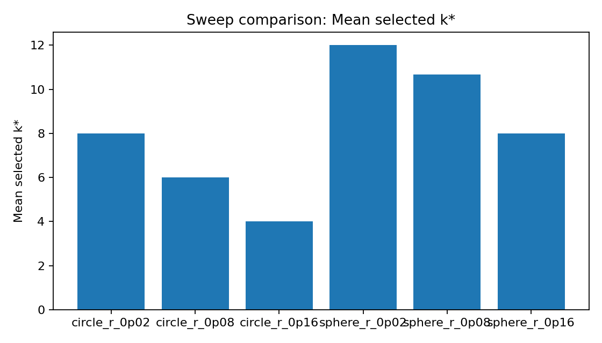
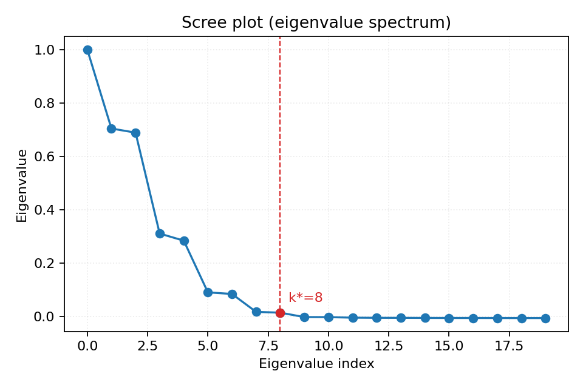
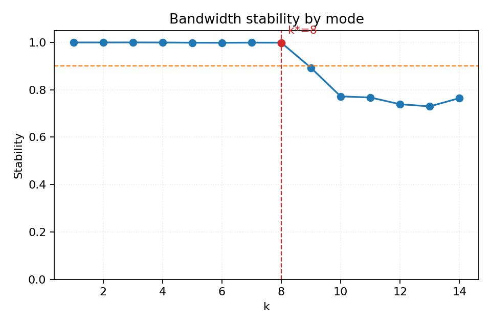
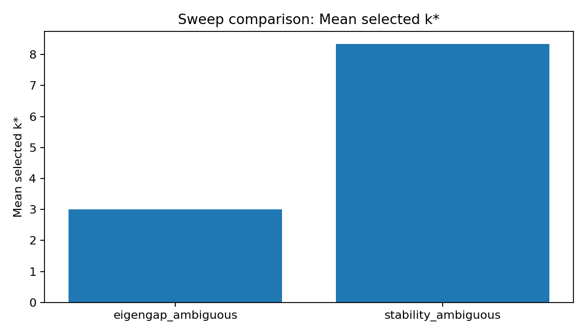

# NASE: Noise-Adaptive Spectral Embedding

A reproducible toolkit for studying how additive noise degrades spectral manifold embeddings and for selecting a truncation cutoff that is robust to noise-contaminated eigenvectors.

Built for DSC 205 (Winter 2026, UC San Diego).

---

## Motivation

Diffusion maps and Laplacian eigenmaps work by truncating a spectral expansion at some dimension `k`. In clean data this is straightforward, but when observations are corrupted by additive noise the high-index eigenvectors increasingly reflect noise rather than manifold geometry. The standard eigengap heuristic can become ambiguous or misleading in these regimes because the gap structure flattens out.

We wanted a practical, data-driven alternative: a cutoff criterion that identifies the boundary between geometrically stable modes and noise-dominated ones, without requiring knowledge of the noise amplitude or the manifold's intrinsic dimension.

## Approach

### Baseline: eigengap heuristic

The eigengap method picks `k` at the largest drop in consecutive eigenvalues within a bounded range. It is simple and well-understood, but in noisy settings the gap can be small, non-unique, or shifted.

### Primary: bandwidth-stability cutoff

Our main method evaluates eigenvector stability across a grid of kernel bandwidths (epsilon values). For each mode index `k`, we measure how well the k-th eigenvector aligns across operators built at different bandwidths. Modes that remain consistent are treated as signal; the cutoff `k*` is the largest index where stability exceeds a threshold (default 0.9).

The intuition: true geometric eigenvectors are determined by the manifold and are relatively insensitive to moderate bandwidth changes. Noise-dominated modes, on the other hand, reshuffle when the bandwidth shifts.

### Oracle baseline

For synthetic experiments where we have access to clean data, we also compute an oracle cutoff by finding the `k` that minimises subspace distance between the clean and noisy leading eigenspaces. This provides an upper bound on how well any method could do.

### Phase 2: Intrinsic dimension estimation

We integrated the Levina-Bickel kNN MLE intrinsic dimension estimator into the experiment pipeline. When `estimators.enable_intrinsic_dim: true` is set in a config, the runner estimates intrinsic dimension from both the noisy and clean point clouds. The estimate is reported in `metrics.json` as `estimated_intrinsic_dim_noisy` and `estimated_intrinsic_dim_clean`, and `ceil(d_hat)` is included as `k_intrinsic_dim` in the cutoff ablation plot alongside eigengap, stability, and oracle cutoffs.

The intrinsic dimension estimate serves as an independent diagnostic — it gives a data-driven reference for how many dimensions the manifold actually has, which helps interpret whether the stability cutoff is retaining a reasonable number of modes.

### Exploratory modules

- **Doubly stochastic scaling (DSS)**: Sinkhorn-Knopp scaling of the affinity matrix, implemented in `src/nase/robust/dss.py`. Available via `graph.enable_dss: true` in config but not used in current experiments.

## What We Built

| Module | Path | Purpose |
|--------|------|---------|
| Data generation | `src/nase/data/synthetic.py` | Circle, sphere, swiss roll, S-curve, torus with controlled Gaussian noise and random ambient embedding |
| Graph construction | `src/nase/graphs/` | Squared-distance backends (dense + kNN sparse), Gaussian kernel with optional local scaling, alpha-normalisation, row-normalisation |
| Spectral embedding | `src/nase/spectral/` | Symmetric eigendecomposition, diffusion operator construction, diffusion map embedding with diffusion time `t` |
| Cutoff selection | `src/nase/cutoffs/` | Eigengap (`eigengap.py`), bandwidth stability (`bandwidth_stability.py`) |
| Quality metrics | `src/nase/metrics/` | Trustworthiness, continuity (neighbourhood overlap), geodesic consistency (Spearman correlation with kNN shortest-path distances), subspace distance via principal angles, oracle cutoff |
| Plotting | `src/nase/plots/` | Spectrum, eigengap bar chart, stability-vs-mode curve, stability heatmap across epsilon pairs, 2D/3D embedding scatter, cutoff ablation comparison |
| Experiment runner | `src/nase/experiments/runner.py` | Runs a single config end-to-end: data → graph → eigendecomposition → cutoff selection → metrics → plots → serialised artifacts |
| Sweep runner | `src/nase/experiments/sweeps.py` | Runs a multi-case, multi-seed sweep with aggregation (mean/std of `k*` and quality metrics) |
| CLI | `src/nase/cli.py` | Three commands: `nase run`, `nase sweep`, `nase plot` |
| Config system | `src/nase/config.py`, `src/nase/experiments/configs.py` | Typed dataclass configs loaded from YAML with deep-merge override support for sweeps |
| Robust kernels | `src/nase/robust/dss.py` | Sinkhorn-Knopp doubly stochastic scaling (opt-in) |
| Intrinsic dim | `src/nase/estimators/intrinsic_dimension.py` | Levina-Bickel MLE estimator, integrated into runner via `estimators.enable_intrinsic_dim` config flag |

## Experiments

We ran experiments in phases, each controlled by YAML config files under `configs/`.

### Phase 1: Synthetic noise sweeps

These test whether the bandwidth-stability cutoff correctly adapts `k*` as noise increases on manifolds with known geometry.

| Config | Manifold | Noise levels | Seeds | Command |
|--------|----------|-------------|-------|---------|
| `configs/synthetic_noise_sweep.yaml` | Swiss roll | r = 0.03, 0.08, 0.16 | 11, 22, 33 | `nase sweep --config configs/synthetic_noise_sweep.yaml` |
| `configs/noise_sweep_circle_sphere.yaml` | Circle + sphere | r = 0.02, 0.08, 0.16 | 11, 22, 33 | `nase sweep --config configs/noise_sweep_circle_sphere.yaml` |
| `configs/synthetic_bandwidth_sweep.yaml` | Swiss roll | r = 0.08 (narrow vs wide epsilon grid) | 101, 202 | `nase sweep --config configs/synthetic_bandwidth_sweep.yaml` |

**Single-run configs** for quick iteration:

| Config | What it does | Command |
|--------|-------------|---------|
| `configs/swiss_roll_stability.yaml` | Single swiss roll run, bandwidth-stability cutoff | `nase run --config configs/swiss_roll_stability.yaml` |
| `configs/smoke_small.yaml` | Fast smoke test (120-point circle) | `nase run --config configs/smoke_small.yaml` |

### Phase 1b: Ambiguous eigengap tests

These compare eigengap and bandwidth-stability cutoffs in settings designed to have unclear gap structure.

| Config | Manifold | Design | Seeds | Command |
|--------|----------|--------|-------|---------|
| `configs/eigengap_ambiguous_suite.yaml` | Sphere (D=6) | Eigengap vs stability on same noisy data (r=0.14) | 7, 8, 9 | `nase sweep --config configs/eigengap_ambiguous_suite.yaml` |
| `configs/ambiguous_gap_suite.yaml` | S-curve | Eigengap vs stability mode comparison (r=0.12) | 7, 8, 9 | `nase sweep --config configs/ambiguous_gap_suite.yaml` |
| `configs/ambiguous_gap_baseline.yaml` | S-curve | Single eigengap baseline run | — | `nase run --config configs/ambiguous_gap_baseline.yaml` |

### Phase 2: Intrinsic dimension estimation

These runs enable the Levina-Bickel intrinsic dimension estimator alongside the standard cutoff pipeline. The estimated dimension is reported in metrics and appears as `k_intrinsic_dim` in the ablation comparison.

| Config | Manifold | Noise levels | Seeds | Command |
|--------|----------|-------------|-------|---------|
| `configs/intrinsic_dim_circle_sphere.yaml` | Circle + sphere | r = 0.02, 0.16 | 11, 22, 33 | `nase sweep --config configs/intrinsic_dim_circle_sphere.yaml` |
| `configs/intrinsic_dim_swiss_roll.yaml` | Swiss roll | r = 0.03, 0.16 | 11, 22 | `nase sweep --config configs/intrinsic_dim_swiss_roll.yaml` |

### Phase 3: Real data

**TODO.** No real-data configs or loaders exist yet. This is the next planned development phase. See [Future work: real data experiments](#future-work-real-data-experiments) below for details on what this would involve.

## How Data Is Created

All experiments in this project use **synthetic manifold data** generated by `src/nase/data/synthetic.py`. No external datasets are downloaded or loaded. The data generation process works as follows:

1. **Sample a manifold.** Points are drawn uniformly on a low-dimensional manifold (circle, sphere, swiss roll, S-curve, or torus) in its native coordinate system. Each manifold generator returns the clean points, their latent parameters (e.g., angle `theta` for a circle), and the native embedding dimension.

2. **Embed in ambient space.** The clean manifold points are zero-padded to the configured `ambient_dim` and then rotated by a random orthogonal matrix (deterministic given the seed). This simulates the common real-world situation where a low-dimensional structure lives in a higher-dimensional observation space at an unknown orientation.

3. **Add noise.** Isotropic Gaussian noise with standard deviation `r` (the `noise_std` config parameter) is added to every coordinate of the ambient-space points. The noise amplitude is known by construction, which allows us to compare method behaviour across controlled noise regimes.

4. **Deterministic seeding.** A single `numpy.random.Generator` with the configured `seed` value controls all randomness (manifold sampling, ambient rotation, noise). Runs with the same seed and config reproduce identical data.

Each experiment config specifies: `manifold`, `n_samples`, `ambient_dim`, `noise_std`, and `seed`. Sweep configs override these per-case and iterate over multiple seeds to estimate variance.

The pipeline then builds a graph from the noisy points, computes spectral embeddings at multiple bandwidths, and runs the cutoff selection methods. Clean points are used only for the oracle cutoff (subspace distance between clean and noisy eigenspaces) and for the clean intrinsic dimension estimate — they are never used by the primary cutoff methods.

## Results

All results live under `results/`. Each sweep directory contains `aggregate.json`, `records.csv`, `records.json`, `manifest.json`, and a `runs/` subdirectory with per-seed outputs.

### Noise sweep on circle and sphere (most informative)

The circle/sphere noise sweep (`configs/noise_sweep_circle_sphere.yaml`) shows the clearest signal. As noise increases, the stability cutoff selects fewer dimensions, consistent with more modes being corrupted.

| Case | Noise r | Mean k* | Trustworthiness | Continuity | Geodesic consistency |
|------|---------|---------|-----------------|------------|---------------------|
| circle_r_0p02 | 0.02 | 8.0 | 0.9997 | 0.885 | 0.778 |
| circle_r_0p08 | 0.08 | 6.0 | 0.993 | 0.584 | 0.770 |
| circle_r_0p16 | 0.16 | 4.0 | 0.981 | 0.453 | 0.746 |
| sphere_r_0p02 | 0.02 | 12.0 | 0.855 | 0.440 | 0.442 |
| sphere_r_0p08 | 0.08 | 10.7 | 0.854 | 0.403 | 0.435 |
| sphere_r_0p16 | 0.16 | 8.0 | 0.853 | 0.320 | 0.415 |

> Source: `results/20260302_174322_noise_sweep_circle_sphere/aggregate.json`

The trend is monotonic: higher noise → lower `k*` → lower continuity and geodesic consistency, while trustworthiness stays high. This is the expected behaviour — the cutoff correctly removes unstable modes rather than including noise.

### Eigengap vs stability in ambiguous settings

On the sphere with r=0.14 (`configs/eigengap_ambiguous_suite.yaml`), the two methods diverge significantly:

| Method | Mean k* | k* std |
|--------|---------|--------|
| Eigengap | 3.0 | 0.0 |
| Bandwidth stability | 8.3 | 0.58 |

> Source: `results/20260302_174201_eigengap_ambiguous_suite/aggregate.json`

The eigengap locks onto a gap at k=3 that happens to be the largest in a flattened spectrum. The stability method retains more dimensions because those modes are in fact stable across bandwidths. (Trustworthiness and continuity are reported identically in aggregate because the sweep structure evaluates each method on the same noisy data with the same base embedding metrics.)

On the S-curve with r=0.12 (`configs/ambiguous_gap_suite.yaml`), the divergence is even more pronounced:

| Method | Mean k* | Trustworthiness | Continuity |
|--------|---------|-----------------|------------|
| Eigengap | 1.0 | 0.879 | 0.179 |
| Bandwidth stability | 13.0 | 0.914 | 0.258 |

> Source: `results/20260302_173959_ambiguous_gap_suite/aggregate.json`

### Swiss roll results

The swiss roll experiments (`configs/synthetic_noise_sweep.yaml`) consistently selected k*=1 across all noise levels. This appears to be an artifact of the bandwidth grid `[0.5, 1.0, 2.0, 3.0]` being too wide for the swiss roll's local geometry — stability drops sharply for all modes above k=1. The bandwidth sweep (`configs/synthetic_bandwidth_sweep.yaml`) confirms this: both narrow and wide grids yield k*=1 for the swiss roll. A finer, more locally-tuned epsilon grid would likely improve these results.

> Source: `results/20260227_183932_synthetic_noise_sweep/aggregate.json`, `results/20260302_173937_synthetic_bandwidth_sweep/aggregate.json`

### Phase 2: Intrinsic dimension estimates

The intrinsic dimension sweeps (`configs/intrinsic_dim_circle_sphere.yaml`) compare the Levina-Bickel estimate against the true manifold dimension and the cutoff methods.

| Manifold | True d | Noise r | d_hat (noisy, mean) | d_hat (clean) | k_intrinsic_dim | k_stability | k_eigengap | k_oracle |
|----------|--------|---------|---------------------|---------------|-----------------|-------------|------------|----------|
| Circle | 1 | 0.02 | 2.19 | 1.15 | 3 | 8 | 2 | 2 |
| Circle | 1 | 0.16 | 3.27 | 1.15 | 4 | 4 | 2 | 2 |
| Sphere | 2 | 0.02 | 2.42 | 2.25 | 3 | 12 | 3 | 3 |
| Sphere | 2 | 0.16 | 4.68 | 2.25 | 5 | 8 | 3 | 3 |
| Swiss roll | 2 | 0.03 | 2.01 | 1.97 | 2–3 | 1 | 12 | 1 |
| Swiss roll | 2 | 0.16 | 2.18 | 1.97 | 3 | 1 | 11–12 | 1 |

> Sources: `results/20260302_185211_intrinsic_dim_circle_sphere/records.json`, `results/20260302_185307_intrinsic_dim_swiss_roll/records.json`

Key observations:

- The clean-data estimate is close to the true dimension in all cases (circle: 1.15 vs 1, sphere: 2.25 vs 2, swiss roll: 1.97 vs 2).
- Noise inflates the estimate: circle goes from 2.19 at r=0.02 to 3.27 at r=0.16; sphere from 2.42 to 4.68. This is expected — ambient noise adds apparent degrees of freedom.
- The swiss roll estimate is relatively noise-robust (2.01 → 2.18), likely because its 2D structure is well-separated in 3D ambient space.
- `k_intrinsic_dim` (ceiling of d_hat) provides a useful lower-bound reference that is closer to the true manifold dimension than the stability cutoff, which tends to retain more modes than strictly necessary.
- The eigengap and oracle cutoffs for circle and sphere land near the true dimension (k=2 for circle, k=3 for sphere), while the stability cutoff retains more modes that are stable but may not correspond to independent manifold coordinates.

### Representative figures

**Figure 1: Mean selected k\* across circle/sphere noise levels**



> Run: `results/20260302_174322_noise_sweep_circle_sphere/`

**Figure 2: Eigenvalue spectrum for circle (r=0.02, seed 11)**



> Run: `results/20260302_174322_noise_sweep_circle_sphere/runs/20260302_174322_noise_sweep_circle_sphere_circle_r_0p02_seed11/`

**Figure 3: Stability scores for sphere in ambiguous-gap setting (stability method, seed 7)**



> Run: `results/20260302_174201_eigengap_ambiguous_suite/runs/20260302_174211_eigengap_ambiguous_suite_stability_ambiguous_seed7/`

**Figure 4: Eigengap vs stability k\* comparison (ambiguous-gap suite)**



> Run: `results/20260302_174201_eigengap_ambiguous_suite/`

## Reproducibility

### Environment setup

```bash
git clone git@github.com:shreyashreddyk/noise-adaptive-spectral-embedding.git
cd noise-adaptive-spectral-embedding
python -m venv .venv
source .venv/bin/activate
python -m pip install --upgrade pip
python -m pip install -e .[dev]
```

Requires Python >= 3.10. Tested on macOS (darwin 24.6.0).

### Running experiments

Single run:

```bash
nase run --config configs/swiss_roll_stability.yaml
```

Sweep:

```bash
nase sweep --config configs/noise_sweep_circle_sphere.yaml
```

Regenerate plots from an existing run:

```bash
nase plot --run-dir results/<run_directory>
```

The `plot` command also accepts `--dpi`, `--formats`, and `--output-dir` options.

### Makefile shortcuts

```bash
make lint       # ruff check + format check
make test       # pytest -q
make run-small  # quick smoke run (circle, 120 points)
make format     # auto-fix lint + format
make verify     # lint + test together
```

### Run directory layout

Each single run produces:

```
results/<timestamp>_<name>/
├── config.yaml          # exact config used
├── metrics.json         # cutoff values, quality scores, stability scores
├── cutoffs.json         # cutoff comparison (eigengap, stability, oracle)
├── arrays.npz           # embeddings, eigenvalues, eigenvectors, stability data
└── figures/             # or plots/ in older runs
    ├── spectrum.{png,svg}
    ├── eigengap.{png,svg}
    ├── stability.{png,svg}
    ├── stability_heatmap.{png,svg}
    ├── embedding.{png,svg}
    ├── embedding_3d.{png,svg}
    └── ablation_cutoff.{png,svg}
```

Each sweep produces:

```
results/<timestamp>_<name>/
├── aggregate.json         # per-case means and std of k* and metrics
├── records.csv            # flat table of all runs
├── records.json           # same as CSV but JSON
├── manifest.json          # sweep config metadata
├── selected_k_comparison.png
└── runs/                  # individual run directories (same layout as above)
```

### Runtime notes

- `smoke_small.yaml`: ~5 seconds
- `swiss_roll_stability.yaml`: ~15 seconds
- `noise_sweep_circle_sphere.yaml`: ~8–10 minutes (18 runs: 6 cases × 3 seeds)
- `eigengap_ambiguous_suite.yaml`: ~3 minutes (6 runs)
- `intrinsic_dim_circle_sphere.yaml`: ~1 minute (12 runs: 4 cases × 3 seeds)
- `intrinsic_dim_swiss_roll.yaml`: ~30 seconds (4 runs: 2 cases × 2 seeds)

## Repository Layout

```
noise-adaptive-spectral-embedding/
├── src/nase/
│   ├── cli.py                    # typer CLI (run / sweep / plot)
│   ├── config.py                 # typed dataclass configs
│   ├── data/
│   │   ├── synthetic.py          # manifold generators (circle, sphere, swiss roll, s-curve, torus)
│   │   ├── noise.py              # noise utilities
│   │   └── manifolds.py          # manifold registry
│   ├── graphs/
│   │   ├── distances.py          # pairwise distance backends
│   │   ├── kernels.py            # Gaussian kernel (dense + sparse, optional local scaling)
│   │   ├── normalisation.py      # normalisation helpers
│   │   └── normalisations.py     # alpha-normalisation, row-normalisation
│   ├── spectral/
│   │   ├── eigensolvers.py       # symmetric eigensolver wrapper
│   │   ├── embedding.py          # diffusion operator + embedding
│   │   └── diffusion_maps.py     # diffusion map utilities
│   ├── cutoffs/
│   │   ├── eigengap.py           # eigengap heuristic
│   │   ├── bandwidth_stability.py # bandwidth-stability cutoff (primary method)
│   │   └── r_based_stub.py       # placeholder for noise-amplitude-based cutoff
│   ├── metrics/
│   │   ├── embedding_quality.py  # trustworthiness, continuity, geodesic consistency
│   │   ├── subspace.py           # principal angles, subspace distance, oracle cutoff
│   │   └── geodesic.py           # geodesic consistency wrapper
│   ├── estimators/
│   │   └── intrinsic_dimension.py # Levina-Bickel MLE
│   ├── robust/
│   │   └── dss.py                # Sinkhorn-Knopp doubly stochastic scaling
│   ├── plots/
│   │   ├── spectrum.py           # eigenvalue spectrum + eigengap plots
│   │   ├── stability.py          # stability score curve
│   │   ├── stability_heatmap.py  # epsilon-pair stability matrix
│   │   ├── embeddings.py         # 2D/3D scatter plots
│   │   └── ablations.py          # cutoff comparison bar chart + sweep comparisons
│   ├── experiments/
│   │   ├── runner.py             # single-experiment pipeline
│   │   ├── sweeps.py             # multi-seed sweep orchestration
│   │   ├── configs.py            # YAML loading + dict↔config conversion
│   │   ├── io.py                 # run directory creation, JSON/YAML writing
│   │   └── diagnostics.py        # diagnostic metadata collection
│   └── utils.py                  # shared utilities
├── configs/                      # experiment YAML configs (11 files)
├── tests/                        # pytest suite (12 test files)
├── results/                      # experiment outputs (gittracked)
├── references/                   # project proposal and reference papers (PDFs)
├── docs/
│   ├── experiments.md            # experiment suite documentation
│   ├── methodology.md            # methodology overview
│   ├── methodological_note.md    # cutoff method rationale
│   └── references/CITATIONS.md   # citation tracking
├── pyproject.toml                # package config, dependencies, ruff/pytest settings
├── Makefile                      # dev shortcuts
├── CONTRIBUTING.md               # contributor guide
└── LICENSE                       # MIT
```

## Limitations and Future Work

**Known limitations:**

- The swiss roll bandwidth grid `[0.5, 1.0, 2.0, 3.0]` is too coarse, causing the stability method to collapse to k*=1 for all noise levels. A finer, geometry-aware grid would likely produce better results. The circle and sphere experiments, which use a denser grid, do not have this problem.
- The stability threshold (0.9) is a fixed hyperparameter. We did not perform a systematic sensitivity analysis on it.
- All experiments use synthetic data where noise is isotropic Gaussian. Real noise is typically structured and heteroscedastic.
- The Sinkhorn-Knopp DSS module is scaffolded but not evaluated in any experiment config. Its interaction with bandwidth stability is untested.
- Geodesic consistency scores for the swiss roll are negative (around -1.97), suggesting the kNN geodesic approximation breaks down for that manifold geometry at the sample sizes we used.
- The intrinsic dimension estimate from noisy data is inflated by noise (especially for the sphere at high r). It is currently reported as a diagnostic; using it to automatically cap `k*` would require a correction for noise-induced bias.

**Future work:**

- Use the intrinsic dimension estimate as a soft upper bound on `k*` — for example, capping the stability cutoff at `ceil(d_hat) + margin`. This would require a calibrated noise-correction step since the Levina-Bickel MLE overestimates dimension under noise.
- Tune the epsilon grid per manifold (or make it adaptive based on nearest-neighbour distances).
- Evaluate DSS-regularised kernels in comparison experiments.
- Implement principal-angle-based subspace stability (currently a stub in `bandwidth_stability.py`).
- Sensitivity analysis on the stability threshold parameter.

### Future work: real data experiments

Phase 3 would extend NASE to real-world datasets where approximate manifold structure is known or can be validated. This is not yet implemented, but the planned approach is:

1. **Data loading.** Add a `src/nase/data/real.py` module with loaders for standard benchmarks. Candidates include:
   - **Single-cell RNA-seq** (e.g., a subset of the Tabula Muris dataset): cells lie on a low-dimensional developmental trajectory; the expected intrinsic dimension is 1–3; noise comes from technical dropout and biological variability.
   - **Image patches** (e.g., 3×3 high-contrast natural image patches from the van Hateren dataset): the patch manifold is known to be approximately a Klein bottle with intrinsic dimension ~2.
   - **MNIST digits** (single digit class): each digit class traces a low-dimensional manifold of style variations; useful for sanity-checking at moderate scale.

2. **Config integration.** Add a `data.source: real` mode to `DataConfig` with a `data.dataset` field. The runner would dispatch to the real-data loader instead of `generate_synthetic`. Since real data has no clean/noisy split, the oracle cutoff and clean intrinsic dimension estimate would be unavailable — metrics would rely on trustworthiness, continuity, and the noisy intrinsic dimension estimate.

3. **Validation strategy.** Without ground-truth clean data, we would validate by: (a) comparing `k*` against known intrinsic dimension of the dataset, (b) evaluating embedding quality metrics across cutoff methods, and (c) checking stability of `k*` across bootstrap resamples of the data.

4. **Preprocessing.** Real data would likely need log-normalisation (for scRNA-seq), PCA pre-reduction to a moderate ambient dimension (e.g., 50), and nearest-neighbour-based epsilon selection rather than a fixed grid.

## References

1. Coifman, R. R., & Lafon, S. (2006). *Diffusion maps*. Applied and Computational Harmonic Analysis, 21(1), 5–30.
2. von Luxburg, U. (2007). *A tutorial on spectral clustering*. Statistics and Computing, 17, 395–416.
3. Zelnik-Manor, L., & Perona, P. (2004). *Self-tuning spectral clustering*. Advances in Neural Information Processing Systems 17.
4. Levina, E., & Bickel, P. J. (2004). *Maximum likelihood estimation of intrinsic dimension*. Advances in Neural Information Processing Systems 17.
5. El Karoui, N., & Wu, H.-T. *Connection graph Laplacian methods can be made robust to noise*. (Reference copy in `references/`.)
6. DSC 205 course materials and project proposal (stored in `references/DSC205_ProjectProposal.pdf`).

See `docs/references/CITATIONS.md` for the full attribution policy.

## Resume Highlights

- Designed and implemented a spectral embedding pipeline from scratch in Python (numpy, scipy, scikit-learn) with typed configs, deterministic seeding, and structured output artifacts.
- Developed a bandwidth-stability truncation criterion for diffusion maps that adapts the embedding dimension to noise level, validated on 5 synthetic manifolds across 60+ seeded experiment runs.
- Showed that the stability-based cutoff selects monotonically fewer dimensions as noise increases (k*: 12→8 on sphere, 8→4 on circle), while the eigengap heuristic remains fixed or ambiguous in the same settings.
- Integrated a Levina-Bickel intrinsic dimension estimator into the pipeline, producing clean vs noisy dimension estimates that recover true manifold dimension within 15% on clean data (circle: 1.15 vs 1, sphere: 2.25 vs 2, swiss roll: 1.97 vs 2) and quantify noise-induced inflation.
- Built a reproducible experiment framework with YAML-driven sweep configs, multi-seed aggregation, automated plotting, and a CLI (`nase run` / `nase sweep` / `nase plot`).
- Implemented evaluation metrics including trustworthiness, continuity, geodesic consistency (Spearman correlation with kNN shortest-path distances), and oracle subspace distance.
- Maintained a 12-file test suite (49 tests) with pytest covering data generation, graph construction, eigensolvers, cutoff methods, intrinsic dimension estimation, metrics, plotting, and end-to-end runner smoke tests.
