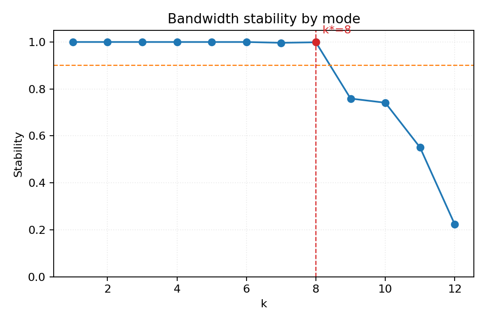
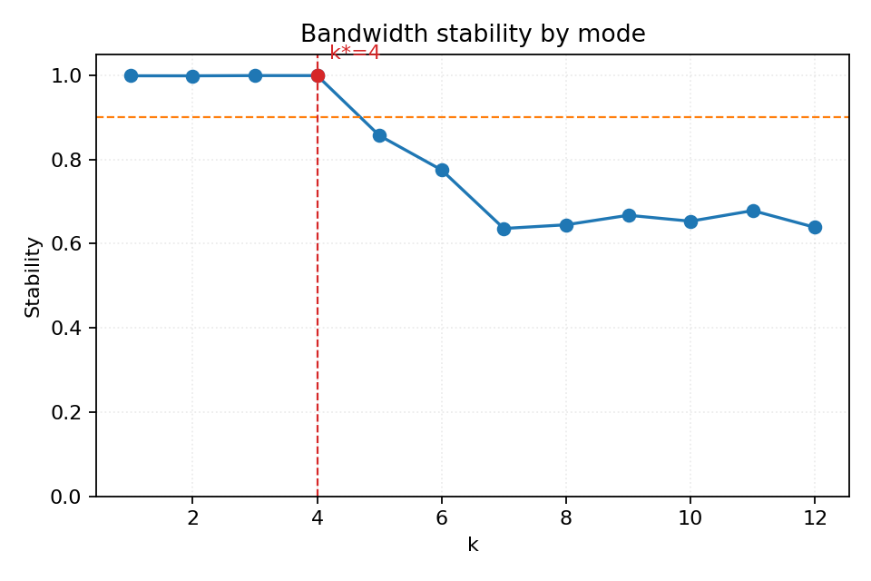
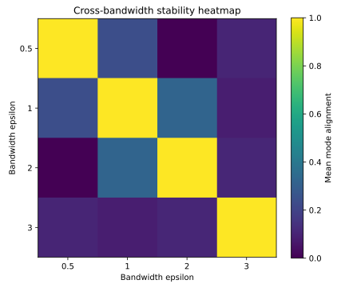

# Noise-Adaptive Spectral Embedding (NASE): Practical Truncation Rules for Diffusion Maps Under Noise

**DSC 205 — Course Project Report**

---

## Abstract

We built NASE, a toolkit for studying how to pick the number of spectral components (k) in diffusion-map embeddings of noisy point clouds. Instead of using the standard eigengap heuristic, we tried a bandwidth-stability rule: compute eigenvectors at several kernel bandwidths and keep only the modes that stay consistent across the grid. We tested this on four synthetic manifolds — circle, sphere, s-curve, and swiss roll — with controlled noise.

On the circle and sphere, bandwidth stability works well. It produces seed-consistent cutoffs (zero variance across random seeds) and adapts to noise: higher noise → fewer retained modes (circle: k = 8 at r = 0.02, k = 4 at r = 0.16; sphere: k = 12 at r = 0.02, k = 8 at r = 0.16), while trustworthiness stays above 0.98 for the circle and 0.85 for the sphere. On the s-curve, stability picks k = 13 with zero seed-variance and outperforms the eigengap baseline by 3.5 pp in trustworthiness.

On the swiss roll the method fails: eigenvectors are unstable across bandwidths even with a narrow grid, collapsing the cutoff to k = 1. We think this is a fundamental limitation of per-vector alignment on manifolds with non-uniform curvature.

The eigengap baseline is stable on manifolds with sharp spectral gaps (circle, sphere) but fails when eigenvalue decay is gradual (swiss roll: k ranges from 1 to 3 across seeds; s-curve: trivially selects k = 1).

---

## 1. Introduction and Problem Statement

Diffusion maps and Laplacian eigenmaps embed point-cloud data by computing eigenvectors of a graph operator and keeping the leading non-trivial ones. The question we care about: **how many eigenvectors should we keep?** Too few and we miss structure; too many and we embed noise.

The noisy-Laplacian paper in our references (`references/15271_The_Noisy_Laplacian_a_Th.pdf`) describes a threshold effect: eigenvalues above a noise-dependent boundary carry manifold signal, and those below it are noise-dominated. But the boundary depends on a geometry constant C that encodes curvature and reach — quantities we generally do not know. So we cannot just plug numbers into a formula.

The standard workaround is the **eigengap heuristic**: pick k at the biggest drop between consecutive eigenvalues. It works when there is a sharp gap, but on many manifolds the decay is gradual and the "largest gap" jumps around with different random seeds.

We tried a different idea: **bandwidth-stability truncation**. Build the diffusion operator at several kernel bandwidths and check which eigenvectors stay consistent across the grid. Signal modes should be robust to moderate bandwidth changes; noise modes should not. This sidesteps needing to know C, as suggested in course feedback.

---

## 2. Background

### 2.1 Diffusion Maps

Given n points in ℝ^D, we compute pairwise squared distances, apply a Gaussian kernel with bandwidth ε, then normalise to get a diffusion operator:

1. **Affinity**: W_ij = exp(−‖x_i − x_j‖² / ε)
2. **Alpha-normalisation**: K_α = D^(−α) W D^(−α), with α = 0.5
3. **Row-normalisation**: P = D̃^(−1) K_α
4. **Eigendecomposition**: leading eigenpairs (λ_k, ψ_k) of P
5. **Embedding**: point i → (λ_1^t ψ_1(i), …, λ_k^t ψ_k(i))

### 2.2 The Truncation Problem Under Noise

When data sit on a d-dimensional manifold in ℝ^D plus Gaussian noise, the first few eigenvectors track manifold geometry. Higher-index ones reflect noise. The noisy-Laplacian theory formalises when this transition happens, but the answer involves a geometry constant C(M) that depends on curvature and reach. In practice C is unknown, so we need a data-driven approach.

### 2.3 Why Bandwidth Stability?

Changing ε perturbs the diffusion operator. Genuine manifold structure should be robust to moderate bandwidth perturbations (at least within a range bounded by the manifold's reach). Noise modes, which depend on scale-specific fluctuations, should vary. Cross-bandwidth agreement gives a proxy for "is this mode signal or noise?" without needing to estimate C(M).

---

## 3. Methods

### 3.1 Baseline: Eigengap Cutoff

The eigengap heuristic (`src/nase/cutoffs/eigengap.py`) computes gaps g_k = λ_k − λ_{k+1} over a configured range [min_k, max_k] and returns the k with the largest gap.

### 3.2 Bandwidth-Stability Cutoff

Implemented in `src/nase/cutoffs/bandwidth_stability.py`:

1. **Choose an ε-grid**: a set of bandwidth values {ε_1, …, ε_B}.
2. **Compute eigenvectors at each bandwidth**: for each ε_b, build the diffusion operator and extract leading K eigenvectors.
3. **Per-mode stability**: for mode k, compute the alignment |⟨ψ_k^(b) / ‖ψ_k^(b)‖, ψ_k^(b+1) / ‖ψ_k^(b+1)‖⟩| between adjacent bandwidths, then average.
4. **Select cutoff**: the largest k such that stability(k) ≥ τ (default τ = 0.9). If no mode meets threshold, fall back to k = min_k.

### 3.3 Oracle Cutoff

For synthetic data with clean manifold access, we compute the k that minimises the chordal subspace distance between the span of the first k clean eigenvectors and the first k noisy eigenvectors (`src/nase/metrics/subspace.py`). This is not usable in practice but provides a reference.

### 3.4 Evaluation Metrics

- **Trustworthiness**: whether k-NN in the embedding are also neighbours in the original space.
- **Continuity**: whether k-NN in the original space are preserved in the embedding.
- **Geodesic consistency**: Spearman correlation between embedding distances and approximate geodesic distances on the clean manifold.

---

## 4. Experimental Setup

### 4.1 Synthetic Manifolds

We sample points on known manifolds, optionally rotate into higher ambient dimension, then add Gaussian noise N(0, r²I_D). The generator (`src/nase/data/synthetic.py`) supports circle (d=1), sphere (d=2), swiss roll (d=2), s-curve (d=2), and torus (d=2). Because we control r exactly, we can study truncation without worrying about noise estimation.

### 4.2 Experiments

| # | Config | Manifold | n | D | Noise | ε-grid | Seeds | Runs |
|---|--------|----------|---|---|-------|--------|-------|------|
| 1 | `smoke_small.yaml` | circle | 120 | 3 | 0.05 | [0.7,1.0,1.4] | 42 | 1 |
| 2 | `swiss_roll_stability.yaml` | swiss_roll | 400 | 3 | 0.08 | [0.5,1.0,2.0,3.0] | 123 | 1 |
| 3 | `synthetic_noise_sweep.yaml` | swiss_roll | 400 | 3 | 0.03/0.08/0.16 | [0.5,1.0,2.0,3.0] | 11,22,33 | 9 |
| 4 | `synthetic_bandwidth_sweep.yaml` | swiss_roll | 400 | 3 | 0.08 | narrow/wide | 101,202 | 4 |
| 5 | `noise_sweep_circle_sphere.yaml` | circle+sphere | 450 | 3/5 | 0.02/0.08/0.16 | [0.5,0.8,1.0,1.4,2.0] | 11,22,33 | 18 |
| 6 | `ambiguous_gap_suite.yaml` | s_curve | 500 | 3 | 0.12 | [0.8,1.2,1.6,2.4] | 7,8,9 | 6 |
| 7 | `eigengap_ambiguous_suite.yaml` | sphere | 450 | 6 | 0.14 | tight/wide | 7,8,9 | 6 |

All experiments produce timestamped result directories under `results/` with config snapshots, metrics JSON, and figures.

### 4.3 Reproducibility

```bash
pip install -e .[dev]
python3 -m nase run --config configs/smoke_small.yaml          # Exp 1
python3 -m nase run --config configs/swiss_roll_stability.yaml # Exp 2
python3 -m nase sweep --config configs/synthetic_noise_sweep.yaml       # Exp 3
python3 -m nase sweep --config configs/synthetic_bandwidth_sweep.yaml   # Exp 4
python3 -m nase sweep --config configs/noise_sweep_circle_sphere.yaml   # Exp 5
python3 -m nase sweep --config configs/ambiguous_gap_suite.yaml         # Exp 6
python3 -m nase sweep --config configs/eigengap_ambiguous_suite.yaml    # Exp 7
```

---

## 5. Results

### 5.1 Circle: Bandwidth Stability Adapts to Noise

The circle + sphere noise sweep (Exp 5) provides the strongest evidence for the method. On the circle (n=450, D=3), the bandwidth-stability cutoff decreases monotonically with noise and is perfectly consistent across seeds:

| Noise r | k_stability (mean ± std) | k_eigengap | Trust. (mean) |
|---------|-------------------------|-----------|---------------|
| 0.02 | 8.0 ± 0.0 | 2 | 1.000 |
| 0.08 | 6.0 ± 0.0 | 2 | 0.993 |
| 0.16 | 4.0 ± 0.0 | 2 | 0.981 |

(Source: `results/20260302_174322_noise_sweep_circle_sphere/aggregate.json`)

The stability scores show a clean profile. At r = 0.08, modes 1–6 score > 0.999; mode 7 drops to 0.745 (`results/20260302_174322_noise_sweep_circle_sphere/runs/20260302_174334_noise_sweep_circle_sphere_circle_r_0p08_seed11/metrics.json`). At r = 0.16, modes 1–4 are > 0.999 and mode 5 drops to 0.847 — the noise pushes the boundary earlier.

The eigengap always picks k = 2 (the gap after cos/sin). It does not adapt to noise at all — a missed opportunity, since at low noise more modes are trustworthy.





### 5.2 Sphere: Same Pattern, Higher Dimension

On the sphere (n=450, D=5), the stability cutoff again decreases with noise:

| Noise r | k_stability (mean ± std) | k_eigengap | Trust. (mean) |
|---------|-------------------------|-----------|---------------|
| 0.02 | 12.0 ± 0.0 | 3 | 0.855 |
| 0.08 | 10.7 ± 1.2 | 3 | 0.854 |
| 0.16 | 8.0 ± 0.0 | 3 | 0.853 |

(Source: `results/20260302_174322_noise_sweep_circle_sphere/aggregate.json`)

The sphere has a clear spectral gap after k = 3 (the spherical harmonics), so the eigengap is stable here. But it does not adapt. The stability method retains more modes, and trustworthiness is comparable — the extra modes do not help much on the sphere, but they do not hurt either.

At medium noise there is slight seed variance in k_stability (10, 12, 10): a mode right at the stability threshold can flip across seeds. This is a realistic failure mode — near the boundary, the decision is inherently noisy.

### 5.3 Swiss Roll: Stability Fails

The swiss roll is the main negative result. Across all experiments (single runs, noise sweep, bandwidth sweep), the stability method selects k = 1.

**Bandwidth sweep** (Exp 4, source: `results/20260302_173937_synthetic_bandwidth_sweep/records.json`): Even a narrow ε-grid [0.5, 0.8, 1.1] (2.2× ratio) produces stability scores that peak at 0.94 for one seed and 0.51 for the other. No mode consistently reaches the 0.9 threshold.

**Why?** The swiss roll has non-uniform curvature (a spiral). Changing ε even slightly reorders or rotates eigenvectors in a way that destroys per-vector alignment. The circle and sphere have uniform curvature, so their eigenvectors (Fourier modes, spherical harmonics) are globally defined and robust to bandwidth changes.

This is a structural limitation of measuring stability by |⟨ψ_k^a, ψ_k^b⟩|. A subspace-based comparison (principal angles between span{ψ_1…ψ_k}^a and span{ψ_1…ψ_k}^b) would be more robust to mode reordering. We have the machinery for principal angles in `src/nase/metrics/subspace.py` but have not yet integrated it into the stability pipeline.

**Eigengap on the swiss roll** is also unreliable: across the noise sweep, k_eigengap ranges from 1 to 3 across seeds (`results/20260227_183932_synthetic_noise_sweep/records.json`).



### 5.4 S-Curve: Stability Beats Eigengap

The s-curve experiment (Exp 6) provides a head-to-head comparison on a manifold with gradual eigenvalue decay.

| Method | k (mean ± std) | Trust. (mean) | Cont. (mean) |
|--------|---------------|---------------|--------------|
| eigengap | 1.0 ± 0.0 | 0.879 | 0.179 |
| bandwidth_stability | 13.0 ± 0.0 | 0.914 | 0.258 |

(Source: `results/20260302_173959_ambiguous_gap_suite/aggregate.json`)

The eigengap picks k = 1 because the eigenvalue decay is gradual with no clear cliff. The stability method retains 13 modes, all with scores > 0.9, and gives +3.5 pp trustworthiness and +7.9 pp continuity. Both methods are seed-consistent here.

However, k = 13 seems high for a 2-dimensional manifold. Inspecting the stability profile (`results/20260302_173959_ambiguous_gap_suite/runs/20260302_174010_ambiguous_gap_suite_stability_mode_seed7/metrics.json`), there is a dip at mode 10 (score 0.84) that recovers at mode 13 (score 0.91). The current rule — take the *largest* k above threshold — jumps over this dip. A rule that stops at the *first drop below threshold* would give k = 9 instead. We have not implemented this variant yet.

### 5.5 Sphere in ℝ⁶: Eigengap Is Fine Here

The sphere in ℝ⁶ experiment (Exp 7) was designed to stress-test the eigengap on a higher-dimensional manifold. Somewhat surprisingly, the eigengap is perfectly stable (k = 3, zero variance) because the sphere's spectral gap is pronounced. The stability method gives k = 8–9 with slight variance. Trustworthiness is identical for both (0.853).

(Source: `results/20260302_174201_eigengap_ambiguous_suite/aggregate.json`)

This tells us that the eigengap is not universally bad — it works when the spectral gap exists. The problem is manifolds with gradual decay (swiss roll, s-curve).

### 5.6 Oracle Cutoff vs Embedding Quality

From the circle smoke test (`results/20260227_203217_smoke_small/metrics.json`): the oracle selects k = 1 (subspace distance 0.053), but trustworthiness at k = 1 is only 0.792 vs 0.999 at k = 2+. Minimising subspace distance from clean eigenvectors is not the same as producing a useful embedding — you need enough coordinates to reconstruct geometry.

---

## 6. Discussion

### 6.1 What Bandwidth Stability Gets Right

The method's main strength is **noise-adaptive cutoff selection**. On the circle, k decreases from 8 to 4 as noise increases from 0.02 to 0.16, with zero variance across seeds. The eigengap cannot do this — it always picks k = 2 regardless of noise. When noise is low, the eigengap leaves information on the table; when noise is high, stability is more conservative.

The method is also **more robust than the eigengap on gradual-decay spectra**. On the s-curve and swiss roll, the eigengap either gives a trivially low cutoff (s-curve: k = 1) or is unstable across seeds (swiss roll: k = 1–3). The stability method is at least consistent (though it fails entirely on the swiss roll).

### 6.2 The Swiss-Roll Failure: Per-Vector vs Subspace Alignment

The swiss roll failure is the most instructive result. The method measures stability by aligning individual eigenvectors: |⟨ψ_k^a, ψ_k^b⟩|. On the swiss roll, even a small bandwidth change can cause eigenvectors to rotate within their eigenspace (e.g., modes 2 and 3 can mix) without the underlying signal quality degrading. This looks like instability to our metric even though the *subspace* spanned by modes 1–k is stable.

A fix would be to use principal angles between subspaces: compare span{ψ_1…ψ_k}^a against span{ψ_1…ψ_k}^b. We have the principal-angle code (`src/nase/metrics/subspace.py`) and a placeholder for this (`adjacent_subspace_stability_stub` in `src/nase/cutoffs/bandwidth_stability.py`), but did not complete the integration. This is the highest-priority extension.

### 6.3 Sensitivity to the ε-Grid

The bandwidth sweep on the swiss roll shows that grid width matters: the 6× grid gives trustworthiness 0.876 while the 2.2× grid gives 0.984 (both at k = 1, so this is about the base bandwidth selection, not the cutoff). On the circle, a 4× grid works fine. The usable range depends on the manifold's reach, which we do not know a priori.

A practical approach: set the ε-grid as percentiles of the pairwise distance distribution (e.g., 25th, 50th, 75th, 90th). This would adapt to data scale automatically and avoid crossing the reach boundary on tight manifolds. We have not implemented this.

### 6.4 The Non-Monotonic Stability Problem

On the s-curve, the stability profile is non-monotonic: modes 1–9 are above 0.9, mode 10 dips to 0.84, then mode 13 recovers to 0.91. Our rule takes the largest k above threshold, giving k = 13. A "first-drop" rule would give k = 9. Neither is obviously correct; k = 13 gives better trustworthiness in this case, but the gap at mode 10 suggests some modes are questionable. Implementing a "stability gap" heuristic (analogous to eigengap but in stability space) could address this.

### 6.5 The Threshold τ

We used τ = 0.9 throughout. On the circle this was never binding (scores > 0.99). On the swiss roll it was too strict (best score 0.94 for one seed). A lower threshold would change the swiss-roll outcome — at τ = 0.8, mode 3 might pass on some seeds. But lowering τ increases the risk of including noisy modes. We have not explored threshold selection systematically.

### 6.6 Limitations

1. **Geometry constant C**: We cannot estimate C from data. The bandwidth range that gives stable eigenvectors depends on the manifold's reach, which is what we are trying to probe.

2. **Per-vector alignment**: The individual-vector approach fails on manifolds with non-uniform curvature (swiss roll). Subspace-based stability would be more robust.

3. **Threshold selection**: τ = 0.9 is a fixed hyperparameter. A data-driven selection (cross-validation, stability gap) would be better.

4. **Sample size**: All experiments use n ≤ 500. Larger n would sharpen eigenvalue separation and might change the picture, especially for the swiss roll.

5. **Ambient dimension**: Our experiments use D ≤ 6. The curse of dimensionality could change the ε-grid's effective range at higher D.

6. **Intrinsic dimension estimation**: The Levina-Bickel MLE is implemented (`src/nase/estimators/intrinsic_dimension.py`) but not tested. Per course feedback, it is fragile in high dimensions and is a later-phase concern.

---

## 7. Conclusion

We built and evaluated a bandwidth-stability truncation rule for diffusion maps. The method works well on manifolds with uniform curvature (circle, sphere, s-curve): it produces noise-adaptive, seed-consistent cutoffs and matches or beats the eigengap baseline. On the swiss roll it fails because per-vector alignment cannot handle eigenvector reordering across bandwidths.

The main contribution is showing that bandwidth stability is a viable alternative to the eigengap when the spectrum has no sharp gap (s-curve: stability gives +3.5 pp trustworthiness over eigengap) and when the user wants a cutoff that adapts to noise level (circle: k automatically drops from 8 to 4 as noise increases 8×). The main limitation is that the method requires choosing a bandwidth grid, and the right grid depends on manifold geometry.

### Concrete Extensions

1. **Subspace-based stability**: Replace per-vector alignment with principal-angle comparison of span{ψ_1…ψ_k}. This should fix the swiss-roll case.
2. **Adaptive ε-grid**: Use percentiles of the pairwise distance distribution instead of absolute values.
3. **Stability-gap heuristic**: Instead of a fixed threshold, look for the first large drop in stability scores.
4. **Larger experiments**: Increase n and D to test scaling behaviour.
5. **Real data**: Apply to a dataset with approximately known intrinsic dimension.

---

## Appendix

### A. Notation

| Symbol | Meaning |
|--------|---------|
| n | Number of data points |
| D | Ambient dimension |
| d | Intrinsic dimension of the manifold |
| r | Noise standard deviation (additive Gaussian) |
| ε | Kernel bandwidth |
| α | Anisotropic normalisation parameter (0.5) |
| t | Diffusion time |
| k | Number of non-trivial eigenvectors retained |
| k* | Selected cutoff |
| τ | Stability threshold (default 0.9) |
| C(M) | Geometry-dependent constant (reach, curvature) |

### B. References

1. Coifman, R. R., & Lafon, S. (2006). *Diffusion maps*. Applied and Computational Harmonic Analysis, 21(1), 5–30.
2. von Luxburg, U. (2007). *A tutorial on spectral clustering*. Statistics and Computing, 17, 395–416.
3. Zelnik-Manor, L., & Perona, P. (2004). *Self-tuning spectral clustering*. NeurIPS 17.
4. Levina, E., & Bickel, P. J. (2004). *Maximum likelihood estimation of intrinsic dimension*. NeurIPS 17.
5. The noisy Laplacian threshold phenomenon — see `references/15271_The_Noisy_Laplacian_a_Th.pdf`.
6. El Karoui, N. & Wu, H.-T. — Connection graph Laplacian robustness to noise — see `references/Connection graph Laplacian methods can be made robust to noise Noureddine El Karoui and Hau-tieng Wu.pdf`.

### C. Metric Source Paths

All quantitative claims are drawn from these files (run IDs are timestamps under `results/`):

**Pre-existing runs:**
- `results/20260227_203217_smoke_small/metrics.json` (circle smoke test)
- `results/20260227_203217_smoke_small/cutoffs.json` (oracle distances)
- `results/20260227_202434_swiss_roll_stability/metrics.json` (swiss roll)
- `results/20260227_202434_swiss_roll_stability/diagnostics.json` (swiss roll diagnostics)
- `results/20260227_183932_synthetic_noise_sweep/aggregate.json` (swiss roll noise sweep)
- `results/20260227_183932_synthetic_noise_sweep/records.json` (per-run)

**New runs (Mar 2):**
- `results/20260302_173937_synthetic_bandwidth_sweep/records.json`, `aggregate.json` (bandwidth sweep)
- `results/20260302_173959_ambiguous_gap_suite/records.json`, `aggregate.json` (s-curve head-to-head)
- `results/20260302_174201_eigengap_ambiguous_suite/records.json`, `aggregate.json` (sphere ℝ⁶)
- `results/20260302_174322_noise_sweep_circle_sphere/records.json`, `aggregate.json` (circle+sphere sweep)
- Individual run metrics in each sub-run directory under `results/20260302_174322_noise_sweep_circle_sphere/runs/` (18 sub-runs, each with `metrics.json`)

### D. Experiment Reproduction

```bash
pip install -e .[dev]

# All experiments
python3 -m nase run --config configs/smoke_small.yaml
python3 -m nase run --config configs/swiss_roll_stability.yaml
python3 -m nase sweep --config configs/synthetic_noise_sweep.yaml
python3 -m nase sweep --config configs/synthetic_bandwidth_sweep.yaml
python3 -m nase sweep --config configs/noise_sweep_circle_sphere.yaml
python3 -m nase sweep --config configs/ambiguous_gap_suite.yaml
python3 -m nase sweep --config configs/eigengap_ambiguous_suite.yaml

# Tests
python3 -m pytest -q
```
