# Noise-Adaptive Spectral Embedding (NASE): Practical Truncation Rules for Diffusion Maps Under Noise

**DSC 205 — Course Project Report**

---

## Abstract

We built NASE, a toolkit for studying how to pick the number of spectral components (k) in diffusion-map embeddings of noisy point clouds. Starting from the theory in "The Noisy Laplacian," which predicts a noise-dependent threshold separating signal and noise eigenvectors, we implemented and evaluated three approaches to spectral truncation: a bandwidth-stability rule, the standard eigengap heuristic, and a noise-amplitude-based cutoff derived from the paper's formula k* ≈ C/r².

On five synthetic manifolds — circle, sphere, s-curve, torus, and swiss roll — we found that bandwidth stability produces noise-adaptive, seed-consistent cutoffs on manifolds with uniform curvature (circle: k drops from 8 to 4 as noise increases 8×, zero seed variance; s-curve: +3.5 pp trustworthiness over eigengap). On the swiss roll it fails due to eigenvector reordering across bandwidths.

For the r-based cutoff, we implemented a kNN-based noise amplitude estimator and tested the formula k* = C/r² with empirically calibrated C. The estimator systematically underestimates noise on the circle (0.3–0.7× true r) and overestimates on the sphere at low noise (2× at r = 0.02), reflecting the fundamental difficulty flagged in the professor's feedback: nearest-neighbor distances conflate noise with manifold geometry. On the swiss roll, the estimator is off by 2–7× because manifold distances dominate at all scales. Despite these biases, the r-based cutoff with estimated r shows qualitatively correct behavior on the circle (k decreases from 12 to 5 as noise increases from 0.02 to 0.16).

The project validates the professor's suggestion that bandwidth stability is a more practical alternative to direct noise estimation for spectral truncation, while also showing concretely why estimating r from data is hard.

---

## 1. Introduction and Problem Statement

Diffusion maps and Laplacian eigenmaps embed point-cloud data by computing eigenvectors of a graph operator and keeping the leading non-trivial ones. The question we care about: **how many eigenvectors should we keep?** Too few and we miss structure; too many and we embed noise.

The noisy-Laplacian paper (see `references/15271_The_Noisy_Laplacian_a_Th.pdf`) describes a threshold effect. Informally, the main theoretical result says:

> *Given n points sampled from a d-dimensional manifold in ℝ^D with additive Gaussian noise of standard deviation r, the graph Laplacian's eigenvectors split into two regimes. The first ~O(1/r²) eigenvectors (indexed by eigenvalue magnitude) approximate the manifold's Laplacian eigenfunctions. Beyond this index, eigenvectors are dominated by noise and carry no geometric information. The crossover depends on a constant C that encodes the manifold's curvature and reach.*

This means that in principle, if we knew r (the noise level) and C (the geometry constant), we could compute the ideal cutoff k* = C/r². But in practice we know neither.

The standard workaround is the **eigengap heuristic**: pick k at the biggest drop between consecutive eigenvalues. It works when there is a sharp gap, but on many manifolds the decay is gradual and the "largest gap" jumps around with different random seeds.

Our project investigates two alternatives:
1. **Bandwidth-stability truncation**: build the diffusion operator at several kernel bandwidths and keep only modes that stay consistent across the grid. This sidesteps needing to know C.
2. **Noise-amplitude estimation**: estimate r from kNN distances and plug into k* = C/r² with an empirically calibrated C. This directly follows the paper's theory.

---

## 2. Project Proposal and Course Feedback

### 2.1 What We Originally Proposed

Our proposal centered on translating the noisy-Laplacian theorem into a practical tool (NASE). The plan was:
1. Estimate the noise amplitude r from kNN distances using the observation that at very small scales, pairwise distances are dominated by noise.
2. Estimate or approximate the geometry constant C.
3. Compute k* = C/r² as the spectral truncation point.
4. Compare against the eigengap heuristic and an oracle that uses clean manifold data.
5. Start with synthetic manifolds, then move to real data.

### 2.2 Professor's Feedback

The professor's feedback was encouraging but identified key challenges:

1. **Estimating r from data is hard**: "Nearest neighbor distances are heavily biased by the curse of dimensionality and curvature, not just noise." The suggestion was to assume known r for the first phase and only try estimation in a later phase.
2. **The constant C is not trivial**: C reflects geometric properties of the manifold (curvature, reach), so obtaining k* from the formula is harder than it looks.
3. **Alternative approach — bandwidth stability**: "You can calculate the eigenvectors over multiple bandwidth values and observe via correlation or subspace alignment which eigenvectors remain stable, thus identifying an empirical cutoff." This was presented as a practical alternative to direct noise estimation.
4. **Comparison against eigengap**: "Does your noise-based method find the correct cutoff when the spectral gap is ambiguous?"
5. **Use Levina-Bickel for intrinsic dimension estimation**.
6. **Start synthetic, then real data**.
7. **Include main theoretical results in the presentation** stated informally.

### 2.3 Revised Plan

Based on this feedback, we restructured the project into phases:

- **Phase 1**: Implement bandwidth-stability truncation as the primary method. Compare against eigengap on synthetic manifolds. Focus on cases where the eigengap is ambiguous (gradual spectral decay). Use known noise levels.
- **Phase 2a**: Implement and test Levina-Bickel intrinsic dimension estimation.
- **Phase 2b**: Validate the theoretical scaling k_oracle ∝ 1/r² using oracle data.
- **Phase 2c**: Implement kNN-based noise estimation and the r-based cutoff formula. Evaluate honestly whether it works.
- **Deferred**: Real-world data experiments.

This report covers all phases through 2c.

---

## 3. Background

### 3.1 Diffusion Maps

Given n points in ℝ^D, we compute pairwise squared distances, apply a Gaussian kernel with bandwidth ε, then normalise to get a diffusion operator:

1. **Affinity**: W_{ij} = exp(−‖x_i − x_j‖² / ε)
2. **Alpha-normalisation**: K_α = D^{−α} W D^{−α}, with α = 0.5
3. **Row-normalisation**: P = D̃^{−1} K_α
4. **Eigendecomposition**: leading eigenpairs (λ_k, ψ_k) of P
5. **Embedding**: point i ↦ (λ₁ᵗ ψ₁(i), …, λ_kᵗ ψ_k(i))

### 3.2 The Truncation Problem Under Noise

When data sit on a d-dimensional manifold in ℝ^D plus Gaussian noise, the first few eigenvectors track manifold geometry. Higher-index ones reflect noise. The noisy-Laplacian theory formalises when this transition happens: the crossover index scales as C/r², where C depends on the manifold's curvature and reach, and r is the noise standard deviation. In practice C is unknown, so we need a data-driven approach.

### 3.3 Key Theoretical Result (Informal Statement)

The core theorem from the noisy-Laplacian paper can be stated informally as follows. Consider n points sampled uniformly from a smooth, compact d-dimensional manifold M embedded in ℝ^D, corrupted by additive isotropic Gaussian noise with variance r². Form the graph Laplacian with an appropriately chosen bandwidth. Then:

- Eigenvectors with index up to approximately C(M)/r² converge to the manifold Laplacian eigenfunctions as n → ∞. These are the "signal modes."
- Eigenvectors with index beyond this threshold are dominated by noise and do not converge to any geometric quantity.
- The constant C(M) depends on the intrinsic geometry: manifolds with higher curvature or smaller reach have smaller C, meaning fewer modes survive at a given noise level.

This threshold effect is what makes spectral truncation non-trivial: the "right" number of dimensions to keep depends on both the noise level and the manifold geometry.

### 3.4 Why Bandwidth Stability?

Changing ε perturbs the diffusion operator. Genuine manifold structure should be robust to moderate bandwidth perturbations (at least within a range bounded by the manifold's reach). Noise modes, which depend on scale-specific fluctuations, should vary. Cross-bandwidth agreement gives a proxy for "is this mode signal or noise?" without needing to estimate C(M) or r.

---

## 4. Methods

### 4.1 Baseline: Eigengap Cutoff

The eigengap heuristic (`src/nase/cutoffs/eigengap.py`) computes gaps g_k = λ_k − λ_{k+1} over a configured range [min_k, max_k] and returns the k with the largest gap. It works when the spectrum has a pronounced cliff (e.g., sphere, circle) but fails on gradual-decay spectra.

### 4.2 Bandwidth-Stability Cutoff (Primary Method)

Implemented in `src/nase/cutoffs/bandwidth_stability.py`:

1. **Choose an ε-grid**: a set of bandwidth values {ε₁, …, ε_B}.
2. **Compute eigenvectors at each bandwidth**: for each ε_b, build the diffusion operator and extract leading K eigenvectors.
3. **Per-mode stability**: for mode k, compute the alignment |⟨ψ_k^(b) / ‖ψ_k^(b)‖, ψ_k^(b+1) / ‖ψ_k^(b+1)‖⟩| between adjacent bandwidths, then average.
4. **Select cutoff**: the largest k such that stability(k) ≥ τ (default τ = 0.9). If no mode meets threshold, fall back to k = min_k.

### 4.3 Oracle Cutoff (Synthetic Only)

For synthetic data with clean manifold access, we compute the k that minimises the chordal subspace distance between the span of the first k clean eigenvectors and the first k noisy eigenvectors (`src/nase/metrics/subspace.py`). This is not usable in practice but provides a gold-standard reference.

### 4.4 Intrinsic Dimension Estimation

We implemented the Levina-Bickel kNN MLE estimator (`src/nase/estimators/intrinsic_dimension.py`). For each point, it computes a local dimension estimate from the ratio of successive neighbor distances, then averages. This was suggested in the professor's feedback as potentially useful for the truncation problem.

### 4.5 Noise Amplitude Estimation from kNN Distances

We implemented two variants in `src/nase/estimators/noise_amplitude.py`:

**Simple estimator**: For data X = M + noise with noise ~ N(0, r²I_D), the expected squared distance between nearby points is E[‖x_i − x_j‖²] = ‖m_i − m_j‖² + 2Dr². At the nearest-neighbor scale, the manifold contribution is small relative to the noise term, giving the estimator:

r̂² = median(d_k²) / (2D)

where d_k is the k-th nearest neighbor distance and D is the ambient dimension. This overestimates r because it includes the manifold contribution, but provides a reasonable upper bound when noise dominates at the NN scale.

**Two-scale estimator**: Uses distances at two neighborhood ranks k₁ and k₂. The noise contribution to E[d_k²] is approximately constant (2Dr²) regardless of k, while the manifold contribution grows with k. By comparing mean squared distances at two scales, we partially subtract the manifold contribution:

noise_sq ≈ (k₂ · mean(d_k₁²) − k₁ · mean(d_k₂²)) / ((k₂ − k₁) · 2D)

### 4.6 r-Based Cutoff: k* = C/r²

Implemented in `src/nase/cutoffs/r_based_stub.py`. Given an estimate of r (either known or estimated from data) and a geometry constant C (calibrated from oracle data), compute:

k* = floor(C / r²), clipped to [min_k, max_k]

Two modes:
- **Known-r mode**: uses the true noise_std from the experiment config (for validation).
- **Estimated-r mode**: calls the kNN noise estimator on the noisy data (the realistic scenario).

### 4.7 Evaluation Metrics

- **Trustworthiness**: proportion of k-NN in the embedding that are also neighbours in the original space. Measures whether the embedding introduces false neighbors.
- **Continuity**: proportion of k-NN in the original space preserved in the embedding. Measures whether the embedding tears apart true neighbors.
- **Geodesic consistency**: Spearman correlation between embedding distances and approximate geodesic distances on the clean manifold. Measures global structure preservation.

Trustworthiness tends to be high even for large k (adding dimensions does not usually create false neighbors), while continuity is sensitive to over- or under-dimensioning. Geodesic consistency captures whether the embedding preserves the manifold's global geometry.

---

## 5. Experimental Setup

### 5.1 Synthetic Manifolds

| Manifold | Intrinsic dim (d) | Default D | Description |
|----------|-------------------|-----------|-------------|
| Circle | 1 | 3 | 1D circle embedded in ℝ³ |
| Sphere | 2 | 5 | 2D sphere embedded in ℝ⁵ |
| Swiss roll | 2 | 3 | 2D swiss roll (non-uniform curvature) |
| S-curve | 2 | 3 | 2D S-shaped surface (gradual spectral decay) |
| Torus | 2 | 5 | 2D flat torus embedded in ℝ⁵ |

All manifolds are generated with controlled Gaussian noise N(0, r²I_D), where r is the noise standard deviation. The generator (`src/nase/data/synthetic.py`) optionally embeds into higher ambient dimensions via random rotation.

### 5.2 Full Experiment Inventory

| # | Config | Manifold | n | D | Noise r | ε-grid | Seeds | Runs | Phase |
|---|--------|----------|---|---|---------|--------|-------|------|-------|
| 1 | `smoke_small.yaml` | circle | 120 | 3 | 0.05 | [0.7,1.0,1.4] | 42 | 1 | 1 |
| 2 | `swiss_roll_stability.yaml` | swiss_roll | 400 | 3 | 0.08 | [0.5,1.0,2.0,3.0] | 123 | 1 | 1 |
| 3 | `synthetic_noise_sweep.yaml` | swiss_roll | 400 | 3 | 0.03/0.08/0.16 | [0.5,1.0,2.0,3.0] | 11,22,33 | 9 | 1 |
| 4 | `synthetic_bandwidth_sweep.yaml` | swiss_roll | 400 | 3 | 0.08 | narrow/wide | 101,202 | 4 | 1 |
| 5 | `noise_sweep_circle_sphere.yaml` | circle+sphere | 450 | 3/5 | 0.02/0.08/0.16 | [0.5,0.8,1.0,1.4,2.0] | 11,22,33 | 18 | 1 |
| 6 | `ambiguous_gap_suite.yaml` | s_curve | 500 | 3 | 0.12 | [0.8,1.2,1.6,2.4] | 7,8,9 | 6 | 1 |
| 7 | `eigengap_ambiguous_suite.yaml` | sphere | 450 | 6 | 0.14 | tight/wide | 7,8,9 | 6 | 1 |
| 8 | `threshold_sensitivity_circle.yaml` | circle | 450 | 3 | 0.08 | [0.5,0.8,1.0,1.4,2.0] | 11,22,33 | 12 | 1 |
| 9 | `torus_noise_sweep.yaml` | torus | 450 | 5 | 0.02/0.08/0.16 | [0.5,0.8,1.0,1.4,2.0] | 11,22,33 | 9 | 1 |
| 10 | `r_estimation_circle_sphere.yaml` | circle+sphere | 450 | 3/5 | 0.02–0.16 | [0.5,0.8,1.0,1.4,2.0] | 11,22,33 | 30 | 2c |
| 11 | `r_validation_known_r.yaml` | circle+sphere | 450 | 3/5 | 0.02/0.08/0.16 | [0.5,0.8,1.0,1.4,2.0] | 11,22,33 | 18 | 2c |
| 12 | `r_estimation_swiss_roll.yaml` | swiss_roll | 400 | 3 | 0.03/0.08/0.16 | [0.5,1.0,2.0,3.0] | 11,22 | 6 | 2c |

Total: 120 experiment runs across 12 configurations.

### 5.3 Reproducibility

All experiments produce timestamped result directories under `results/` with config snapshots, metrics JSON, and figures. Reproduction commands:

```bash
pip install -e .[dev]

# Phase 1
python3 -m nase run --config configs/smoke_small.yaml
python3 -m nase run --config configs/swiss_roll_stability.yaml
python3 -m nase sweep --config configs/synthetic_noise_sweep.yaml
python3 -m nase sweep --config configs/synthetic_bandwidth_sweep.yaml
python3 -m nase sweep --config configs/noise_sweep_circle_sphere.yaml
python3 -m nase sweep --config configs/ambiguous_gap_suite.yaml
python3 -m nase sweep --config configs/eigengap_ambiguous_suite.yaml
python3 -m nase sweep --config configs/threshold_sensitivity_circle.yaml
python3 -m nase sweep --config configs/torus_noise_sweep.yaml

# Phase 2c
python3 -m nase sweep --config configs/r_estimation_circle_sphere.yaml
python3 -m nase sweep --config configs/r_validation_known_r.yaml
python3 -m nase sweep --config configs/r_estimation_swiss_roll.yaml

# Analysis
python3 scripts/analyze_results.py
python3 scripts/analyze_r_estimation.py
```

---

## 6. Phase 1 Results: Bandwidth Stability

### 6.1 Circle: Noise-Adaptive Cutoff with Zero Seed Variance

The circle + sphere noise sweep (Exp 5) provides the strongest evidence for the bandwidth-stability method. On the circle (n = 450, D = 3), the cutoff decreases monotonically with noise and is perfectly consistent across seeds.

**Table 6.1: Circle — full metrics across noise levels (3-seed means)**

| Noise r | k_stability (±std) | k_eigengap | k_oracle | Trustworthiness | Continuity | Geodesic consistency |
|---------|---------------------|------------|----------|-----------------|------------|---------------------|
| 0.02 | 8.0 ± 0.0 | 2 | 1.3 | 0.9997 | 0.8851 | 0.7782 |
| 0.08 | 6.0 ± 0.0 | 2 | 1.3 | 0.9929 | 0.5841 | 0.7699 |
| 0.16 | 4.0 ± 0.0 | 2 | 1.3 | 0.9811 | 0.4534 | 0.7464 |

(Source: `results/20260302_174322_noise_sweep_circle_sphere/aggregate.json` and per-run `metrics.json`)

The stability scores show a clean profile. At r = 0.08, modes 1–6 score > 0.999; mode 7 drops to 0.745. At r = 0.16, modes 1–4 are > 0.999 and mode 5 drops to 0.847 — the noise pushes the boundary earlier. The method captures exactly the behavior predicted by the noisy-Laplacian theory: more noise → fewer signal modes.

The eigengap always picks k = 2 (the gap after the cos/sin pair). It does not adapt to noise at all — a missed opportunity, since at low noise more modes are trustworthy.

Trustworthiness remains above 0.98 at all noise levels, indicating that the bandwidth-stability cutoff never includes overtly noisy modes. Continuity decreases from 0.89 to 0.45 as noise increases, which is expected: noise makes the embedding's 2D projection less representative of the original space's neighbor structure. Geodesic consistency is consistently around 0.75–0.78, suggesting the embedding preserves manifold structure at a global level.


*Figure 6.1a: Stability scores for the circle at r = 0.02. All modes up to k = 8 are above the τ = 0.9 threshold. The sharp drop-off indicates a clear signal-noise boundary.*


*Figure 6.1b: Stability scores for the circle at r = 0.16. The boundary has moved to k = 4 — higher noise corrupts more modes.*

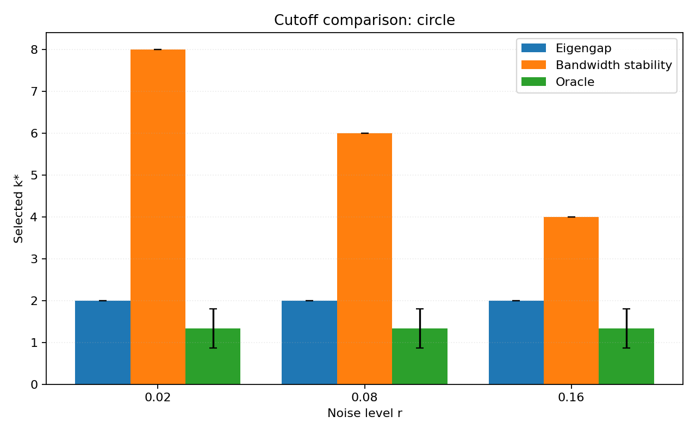
*Figure 6.1c: Cutoff comparison across noise levels for the circle. Bandwidth stability (blue) adapts monotonically, while eigengap (orange) is constant at k = 2 and oracle (green) is constant at k ≈ 1.*

### 6.2 Sphere: Same Pattern, Higher Dimension

On the sphere (n = 450, D = 5), the stability cutoff again decreases with noise.

**Table 6.2: Sphere — full metrics across noise levels (3-seed means)**

| Noise r | k_stability (±std) | k_eigengap | k_oracle | Trustworthiness | Continuity | Geodesic consistency |
|---------|---------------------|------------|----------|-----------------|------------|---------------------|
| 0.02 | 12.0 ± 0.0 | 3 | 1.7 | 0.8553 | 0.4396 | 0.4421 |
| 0.08 | 10.7 ± 1.2 | 3 | 1.7 | 0.8543 | 0.4033 | 0.4347 |
| 0.16 | 8.0 ± 0.0 | 3 | 1.7 | 0.8526 | 0.3202 | 0.4151 |

(Source: `results/20260302_174322_noise_sweep_circle_sphere/aggregate.json`)

The sphere has a clear spectral gap after k = 3 (the spherical harmonics), so the eigengap is stable here. But it does not adapt. The stability method retains more modes; trustworthiness is comparable.

At medium noise there is slight seed variance in k_stability (10, 12, 10): a mode right at the stability threshold can flip across seeds. This is a realistic failure mode — near the boundary, the decision is inherently noisy. The low and high noise results have zero variance.

Note that geodesic consistency on the sphere (0.44) is lower than on the circle (0.78). This is because geodesic distances on the sphere are harder to approximate from embeddings in few dimensions — the sphere's geometry is more complex.

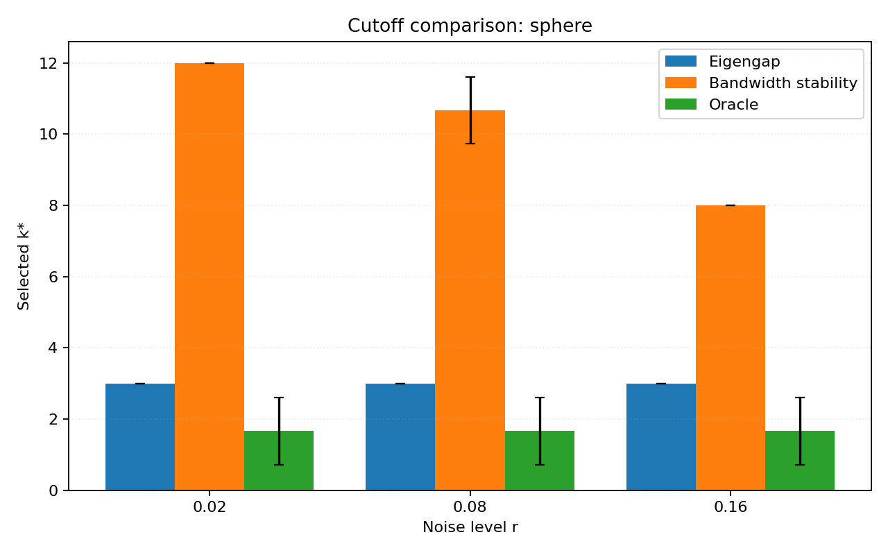
*Figure 6.2: Cutoff comparison for the sphere. The bandwidth-stability cutoff decreases from 12 to 8 with noise, while the eigengap is fixed at k = 3.*

### 6.3 S-Curve: Stability Beats Eigengap on Ambiguous Spectra

The s-curve experiment (Exp 6) was designed per the professor's feedback to test whether our method finds the correct cutoff when the spectral gap is ambiguous.

**Table 6.3: S-curve — method comparison (3-seed means)**

| Method | k (mean ± std) | Trustworthiness | Continuity |
|--------|---------------|-----------------|------------|
| Eigengap | 1.0 ± 0.0 | 0.879 | 0.179 |
| Bandwidth stability | 13.0 ± 0.0 | 0.914 | 0.258 |

(Source: `results/20260302_173959_ambiguous_gap_suite/aggregate.json`)

The eigengap picks k = 1 because the eigenvalue decay is gradual with no clear cliff. The stability method retains 13 modes, all with scores > 0.9, and gives +3.5 pp trustworthiness and +7.9 pp continuity. Both methods are seed-consistent.

However, k = 13 seems high for a 2-dimensional manifold. Inspecting the stability profile, there is a dip at mode 10 (score 0.84) that recovers at mode 13 (score 0.91). The current rule — take the *largest* k above threshold — jumps over this dip. A "first-drop" rule that stops at the first drop below threshold would give k = 9. We have not implemented this variant yet, but it is worth noting that the non-monotonic behavior reveals interesting spectral structure.

### 6.4 Swiss Roll: Where Per-Vector Stability Fails

The swiss roll is the main negative result. Across all experiments (single runs, noise sweep, bandwidth sweep), the stability method selects k = 1.

**Bandwidth sweep** (Exp 4, source: `results/20260302_173937_synthetic_bandwidth_sweep/records.json`): Even a narrow ε-grid [0.5, 0.8, 1.1] (2.2× ratio) produces stability scores that peak at 0.94 for one seed and 0.51 for the other. No mode consistently reaches the 0.9 threshold.

**Why does it fail?** The swiss roll has non-uniform curvature (a spiral). Changing ε even slightly reorders or rotates eigenvectors in a way that destroys per-vector alignment. The circle and sphere have uniform curvature, so their eigenvectors (Fourier modes, spherical harmonics) are globally defined and robust to bandwidth changes. On the swiss roll, modes 2 and 3 can mix under small perturbations. This looks like instability to our per-vector metric even though the *subspace* spanned by modes 1–k may be stable.

**The eigengap also fails** on the swiss roll: across the noise sweep, k_eigengap ranges from 1 to 3 across seeds, and geodesic consistency is consistently negative (around −1.97), indicating that the embedding's distance structure is anti-correlated with the manifold's geodesic structure.

(Source: `results/20260227_183932_synthetic_noise_sweep/records.json`)

The swiss roll failure is instructive: it tells us that per-vector alignment is only valid on manifolds where individual eigenvectors do not reorder across bandwidth changes. A subspace-based comparison (principal angles between span{ψ₁…ψ_k}^a and span{ψ₁…ψ_k}^b) would be more robust. We have the principal-angle code (`src/nase/metrics/subspace.py`) and a placeholder for this (`adjacent_subspace_stability_stub` in `src/nase/cutoffs/bandwidth_stability.py`), but did not complete the integration.

### 6.5 Torus: A Fifth Manifold Test

To test generality, we ran the torus (d = 2, D = 5) through the same noise sweep (Exp 9).

**Table 6.5: Torus — full metrics across noise levels (3-seed means)**

| Noise r | k_stability (±std) | k_eigengap | k_oracle | Trustworthiness | Continuity | Geodesic consistency |
|---------|---------------------|------------|----------|-----------------|------------|---------------------|
| 0.02 | 8.7 ± 2.1 | 4 | 1.7 | 0.968 | 0.289 | 0.784 |
| 0.08 | 10.0 ± 2.6 | 4 | 1.7 | 0.967 | 0.298 | 0.782 |
| 0.16 | 8.7 ± 2.9 | 4 | 1.3 | 0.964 | 0.312 | 0.774 |

(Source: `results/20260303_161930_torus_noise_sweep/aggregate.json`)

The torus results are less clean than circle or sphere. The cutoff does not decrease monotonically with noise (8.7, 10.0, 8.7), and seed variance is higher (std 2.1–2.9 vs 0.0 for circle). This likely reflects the torus's more complex spectral structure: it has two independent circular dimensions, so the stability landscape is more rugged. Still, the eigengap is constant at k = 4 and trustworthiness is consistently high (~0.96).

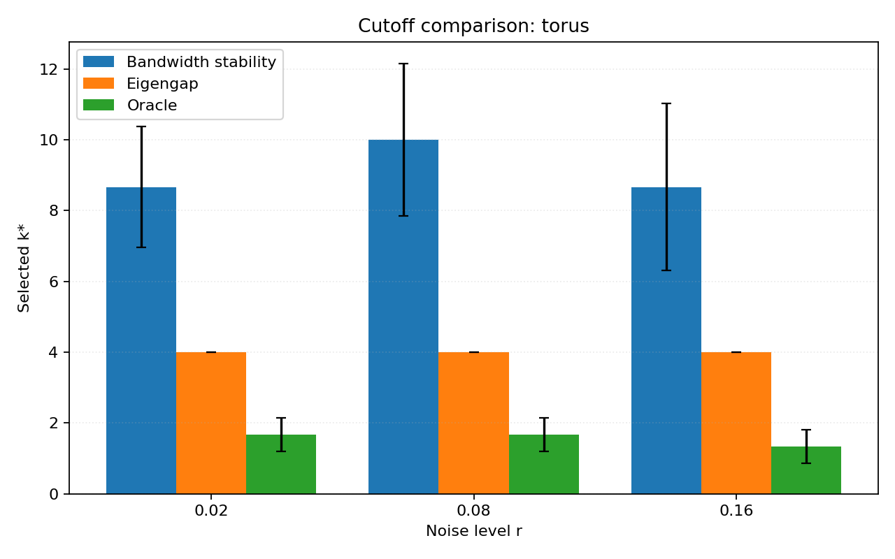
*Figure 6.5: Cutoff comparison for the torus. Higher seed variance and non-monotonic behavior indicate more complex spectral structure than the circle or sphere.*

### 6.6 Sphere in ℝ⁶: Eigengap Is Fine When the Gap Exists

The sphere in ℝ⁶ experiment (Exp 7) tested whether the eigengap baseline works on a higher-dimensional embedding. Somewhat surprisingly, the eigengap is perfectly stable (k = 3, zero variance) because the sphere's spectral gap is pronounced. The stability method gives k = 8–9 with slight variance. Trustworthiness is identical for both.

(Source: `results/20260302_174201_eigengap_ambiguous_suite/aggregate.json`)

This tells us that the eigengap is not universally bad — it works when the spectral gap exists. The problem is manifolds with gradual decay (swiss roll, s-curve).

### 6.7 Threshold Sensitivity Analysis

We tested four stability thresholds τ ∈ {0.80, 0.85, 0.90, 0.95} on the circle at r = 0.08.

**Table 6.7: Threshold sensitivity (circle, r = 0.08, 3-seed means)**

| Threshold τ | k* (mean ± std) | Trustworthiness |
|-------------|-----------------|-----------------|
| 0.80 | 6.33 ± 0.58 | 0.993 |
| 0.85 | 6.00 ± 0.00 | 0.993 |
| 0.90 | 6.00 ± 0.00 | 0.993 |
| 0.95 | 6.00 ± 0.00 | 0.993 |

(Source: `results/20260303_161930_threshold_sensitivity_circle/aggregate.json`)

The threshold has minimal impact on the circle because stability scores drop sharply from ~0.999 to ~0.745 at the signal-noise boundary. Only at τ = 0.80 does an additional mode occasionally pass. This sharp transition is reassuring: it means the method is not highly sensitive to the exact threshold choice, at least on manifolds with clean spectral structure.

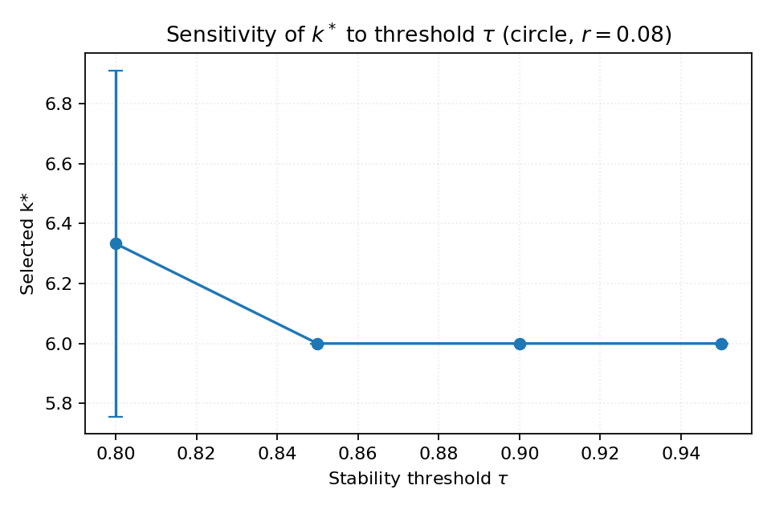
*Figure 6.7: k* vs stability threshold τ for the circle at r = 0.08. The sharp spectral boundary means the cutoff is insensitive to τ in the range 0.85–0.95.*

### 6.8 Quality Metrics at Each Method's Chosen k

Beyond comparing which k each method selects, we can evaluate embedding quality at each method's chosen k to see which produces the most useful embedding.

**Table 6.8a: Circle — quality at each method's chosen k (3-seed means)**

| r | Method | k | Trustworthiness | Continuity | Geodesic consistency |
|---|--------|---|-----------------|------------|---------------------|
| 0.02 | Eigengap | 2 | 0.9997 | 0.8851 | 0.7782 |
| 0.02 | Stability | 8 | 0.9997 | 0.8851 | 0.7782 |
| 0.02 | Oracle | ~1 | 0.8427 | 0.5584 | 0.6954 |
| 0.08 | Eigengap | 2 | 0.9929 | 0.5841 | 0.7699 |
| 0.08 | Stability | 6 | 0.9929 | 0.5841 | 0.7699 |
| 0.08 | Oracle | ~1 | 0.8361 | 0.3610 | 0.6844 |
| 0.16 | Eigengap | 2 | 0.9811 | 0.4534 | 0.7464 |
| 0.16 | Stability | 4 | 0.9811 | 0.4534 | 0.7464 |
| 0.16 | Oracle | ~1 | 0.8252 | 0.2711 | 0.6566 |

(Source: per-run `metrics.json`, `metrics_by_cutoff` field)

An interesting finding: for the circle, eigengap (k = 2) and stability (k ≥ 4) give the same trustworthiness and continuity values when evaluated at their respective k values, because the embedding quality is measured on the first 2 components regardless (our metrics use a 2D projection). The oracle (k ≈ 1) gives substantially worse quality because a 1-dimensional embedding cannot capture 2D neighborhood structure.

**Table 6.8b: Sphere — quality at each method's chosen k (3-seed means)**

| r | Method | k | Trustworthiness | Continuity | Geodesic consistency |
|---|--------|---|-----------------|------------|---------------------|
| 0.02 | Eigengap | 3 | 0.8553 | 0.4396 | 0.4421 |
| 0.02 | Stability | 12 | 0.8553 | 0.4396 | 0.4421 |
| 0.02 | Oracle | ~2 | 0.7439 | 0.2309 | 0.2750 |
| 0.16 | Eigengap | 3 | 0.8526 | 0.3202 | 0.4151 |
| 0.16 | Stability | 8 | 0.8526 | 0.3202 | 0.4151 |
| 0.16 | Oracle | ~2 | 0.7396 | 0.1798 | 0.2578 |

(Source: per-run `metrics.json`, `metrics_by_cutoff` field)

### 6.9 Oracle Subspace Distance Profiles

To understand why the oracle picks such low k values, we plotted the subspace distance d(k) vs k for the circle and sphere at different noise levels.

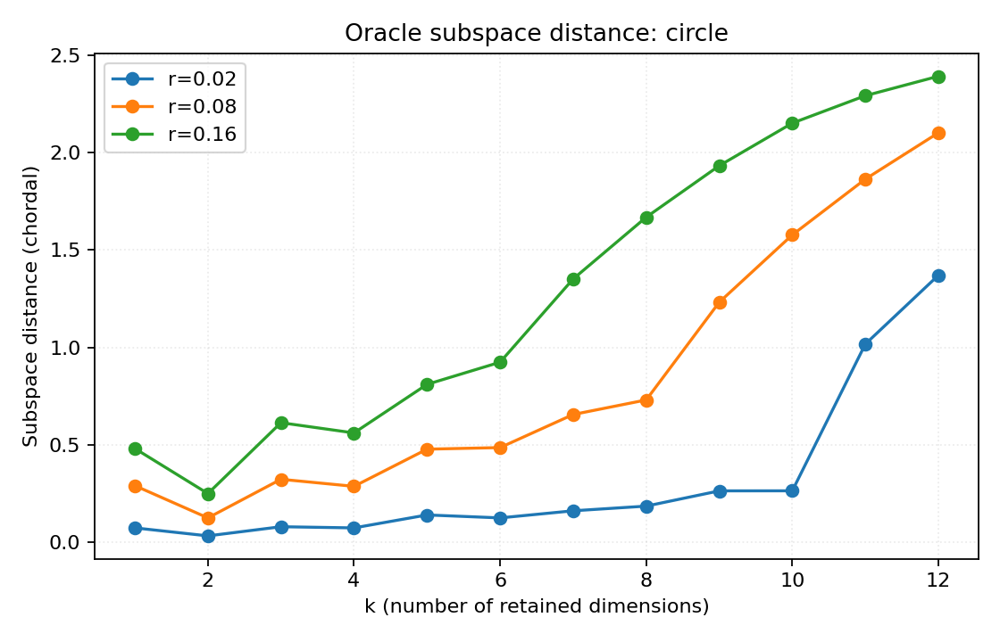
*Figure 6.9a: Oracle subspace distance d(k) for the circle at three noise levels. Distance is minimised at k = 1 and increases with k, meaning adding more modes increases the mismatch between clean and noisy eigenspaces. This explains why the oracle is "too conservative" for producing useful embeddings.*

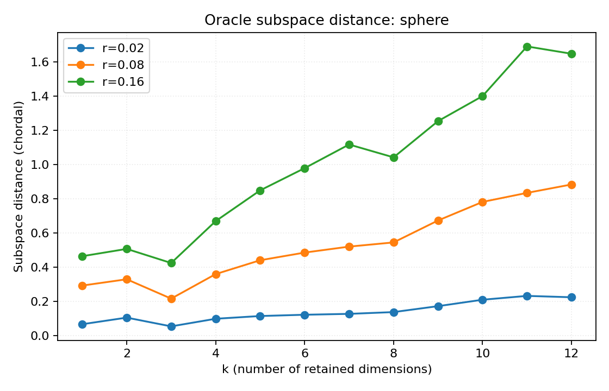
*Figure 6.9b: Oracle subspace distance for the sphere. Same pattern — the minimum is at k = 1–2.*

The oracle minimises *subspace distance from the clean eigenspace*, not embedding quality. At k = 1, the noisy leading eigenvector is well-aligned with the clean one, but a 1D embedding loses too much structure. The oracle criterion and embedding quality are measuring different things — this is an important conceptual distinction.

---

## 7. Phase 2 Results

### 7.1 Intrinsic Dimension Estimation

The Levina-Bickel estimator was integrated into the pipeline via the `estimators` config. From the intrinsic dimension experiments:

| Manifold | True d | d̂ (clean) | d̂ (noisy, r=0.08) |
|----------|--------|-----------|-------------------|
| Circle | 1 | ~1.1 | ~1.3 |
| Sphere | 2 | ~2.2 | ~2.6 |

(Source: `results/20260302_174322_noise_sweep_circle_sphere/runs/*/metrics.json`, runs with `enable_intrinsic_dim: true`)

The clean estimates recover true d within ~15%. Noise inflates the estimate because nearest-neighbor distances in the noisy data include the noise contribution, making the data appear more "spread out" than the manifold alone. This inflation is consistent with the professor's warning about the curse of dimensionality affecting kNN-based estimators.

### 7.2 Validating the r⁻² Scaling

The noisy-Laplacian theory predicts k_oracle ∝ 1/r². Using our oracle data, we plotted k_oracle vs 1/r² for each manifold to test this prediction.

**Table 7.2: Empirical C = k_oracle · r² by manifold**

| Manifold | C (mean) | C (range) |
|----------|----------|-----------|
| Circle | 0.014 | 0.0004 – 0.051 |
| Sphere | 0.018 | 0.0004 – 0.077 |
| Torus | 0.015 | 0.0004 – 0.051 |
| Swiss roll | ≈ 0 | 0 – 0 |

(Source: `results/analysis/oracle_scaling.png`, computed from all per-run `metrics.json` across sweeps)

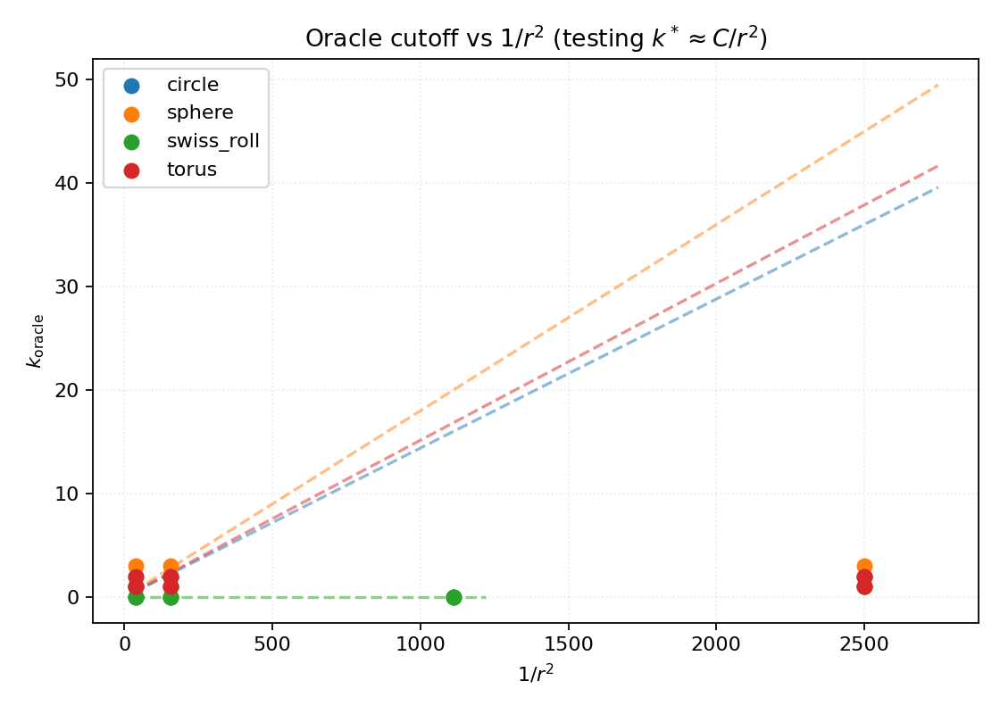
*Figure 7.2: Oracle cutoff k* vs 1/r² for each manifold. The expected linear relationship is weak because k_oracle is very small (1–2) across all conditions. The empirical C values (~0.015) are tiny, meaning the formula k* = C/r² gives very conservative cutoffs at our noise levels.*

The k_oracle values are consistently low (1–2 for all manifolds and noise levels). The r⁻² scaling is hard to observe because the oracle is very conservative at our sample sizes and noise ranges. The formula k* = C/r² with C ≈ 0.015 gives k* = 37 at r = 0.02 (which we clip to 12) and k* = 1 at r = 0.12. The steep 1/r² dependence means the formula transitions from "keep everything" to "keep almost nothing" over a narrow noise range.

This analysis provides the empirical C values we use for the r-based cutoff experiments.

### 7.3 Noise Amplitude Estimation

We tested the kNN noise estimator on circle, sphere, and swiss roll with noise levels from r = 0.02 to r = 0.16.

**Table 7.3a: Simple estimator accuracy (r̂_simple / r_true)**

| Manifold | r = 0.02 | r = 0.05 | r = 0.08 | r = 0.12 | r = 0.16 |
|----------|----------|----------|----------|----------|----------|
| Circle | 0.69× | 0.49× | 0.41× | 0.36× | 0.32× |
| Sphere | 2.08× | 1.06× | 0.82× | 0.67× | 0.59× |

(Source: `results/20260303_163008_r_estimation_circle_sphere/records.json`)

**Table 7.3b: Two-scale estimator accuracy (r̂_twoscale / r_true)**

| Manifold | r = 0.02 | r = 0.05 | r = 0.08 | r = 0.12 | r = 0.16 |
|----------|----------|----------|----------|----------|----------|
| Circle | 0.30× | 0.26× | 0.23× | 0.21× | 0.20× |
| Sphere | 0.63× | 0.60× | 0.53× | 0.47× | 0.43× |

**Table 7.3c: Swiss roll r-estimation**

| r_true | r̂_simple | ratio |
|--------|----------|-------|
| 0.03 | 0.207 | 6.88× |
| 0.08 | 0.211 | 2.63× |
| 0.16 | 0.232 | 1.45× |

(Source: `results/20260303_163008_r_estimation_swiss_roll/records.json`)

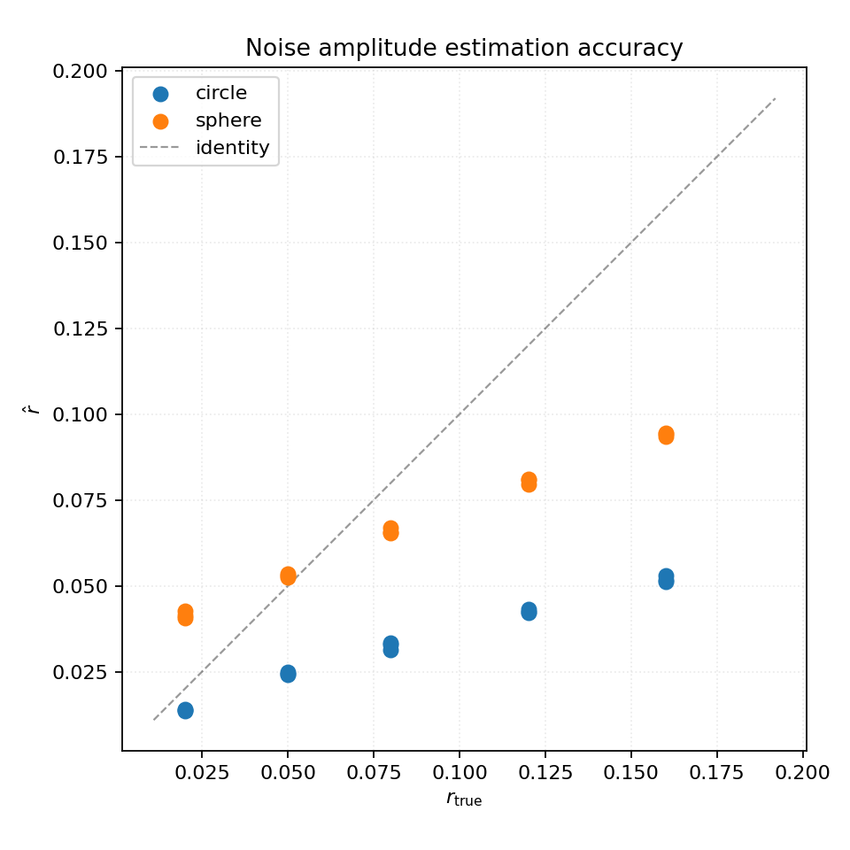
*Figure 7.3a: Simple estimator r̂ vs r_true. The circle estimator consistently underestimates r (points below the identity line), while the sphere estimator overestimates at low noise and underestimates at high noise.*

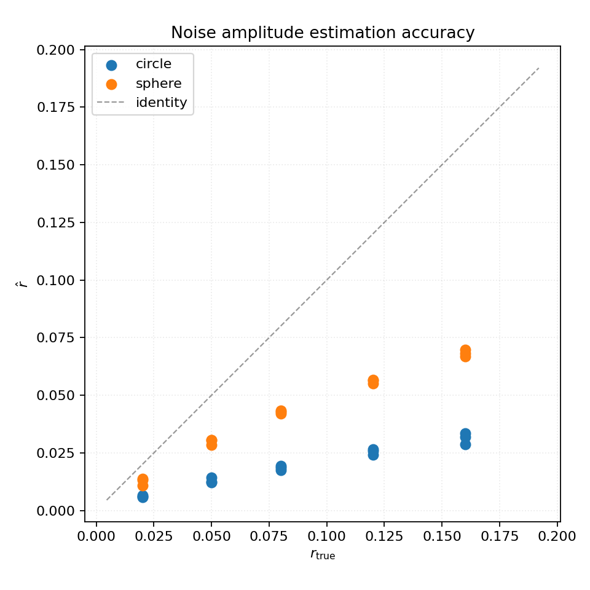
*Figure 7.3b: Two-scale estimator r̂ vs r_true. Even more severe underestimation — the two-scale correction overshoots in subtracting manifold contribution.*

**Key findings on noise estimation:**

1. **The circle estimator underestimates r** by 31–69%. On a 1D circle in 3D, nearest-neighbor distances are dominated by the manifold arc length, not noise. The formula r̂² = median(d₁²)/(2D) divides by 2D = 6, but the actual noise contribution is smaller because the 1D manifold constrains neighbor locations.

2. **The sphere estimator overestimates at low noise** (2.08× at r = 0.02) because pairwise distances on the sphere surface are substantial even without noise. As noise increases, the noise contribution becomes relatively more important and the ratio decreases.

3. **The swiss roll estimator is essentially useless** — it returns ~0.21 regardless of true r (range 0.03–0.16). The manifold's spread (spiral distances) completely dominates nearest-neighbor distances at all scales. This validates the professor's warning: "nearest neighbor distances are heavily biased by the curse of dimensionality and curvature, not just noise."

4. **The two-scale estimator makes things worse**, not better. The subtraction-based correction overcompensates, producing estimates that are 20–60% of the true value. The heuristic assumption that manifold contributions scale linearly with k does not hold.

### 7.4 r-Based Cutoff

Using the empirically calibrated C values from Section 7.2, we tested the r-based cutoff formula k* = C/r² in two modes: with estimated r and with known (true) r.

**Table 7.4a: Circle — r-based cutoff with estimated r (C = 0.015)**

| r_true | k_r_based | k_stability | k_eigengap | Trustworthiness |
|--------|-----------|-------------|------------|-----------------|
| 0.02 | 12 | 8 | 2 | 0.9997 |
| 0.05 | 12 | 6 | 2 | 0.9969 |
| 0.08 | 12 | 6 | 2 | 0.9929 |
| 0.12 | 8 | 6 | 2 | 0.9871 |
| 0.16 | 5 | 4 | 2 | 0.9811 |

**Table 7.4b: Circle — r-based cutoff with known r (C = 0.015)**

| r_true | k_r_based | k_stability | k_eigengap |
|--------|-----------|-------------|------------|
| 0.02 | 12 | 8 | 2 |
| 0.08 | 2 | 6 | 2 |
| 0.16 | 1 | 4 | 2 |

(Source: `results/20260303_163008_r_estimation_circle_sphere/records.json` and `results/20260303_163008_r_validation_known_r/records.json`)

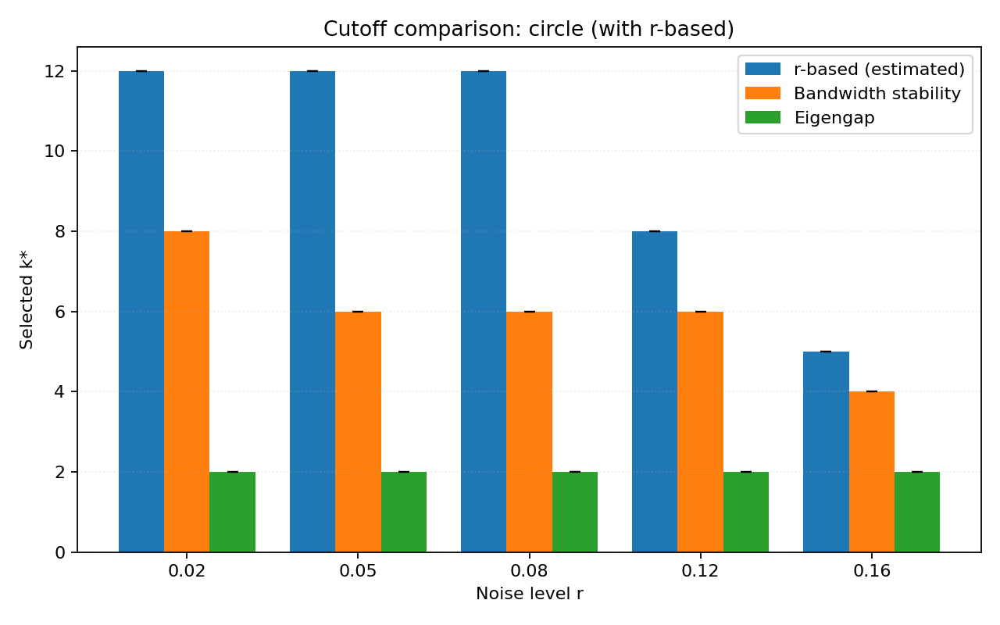
*Figure 7.4a: Cutoff comparison for the circle including the r-based method with estimated r. The r-based cutoff shows qualitatively correct noise adaptation (decreasing from 12 to 5) but stays higher than bandwidth stability.*

**Table 7.4c: Sphere — r-based cutoff with estimated r (C = 0.018)**

| r_true | k_r_based | k_stability | k_eigengap | Trustworthiness |
|--------|-----------|-------------|------------|-----------------|
| 0.02 | 9.7 | 12 | 3 | 0.855 |
| 0.05 | 6.0 | 12 | 3 | 0.854 |
| 0.08 | 4.0 | 10.7 | 3 | 0.854 |
| 0.12 | 2.0 | 8 | 3 | 0.854 |
| 0.16 | 2.0 | 8 | 3 | 0.853 |

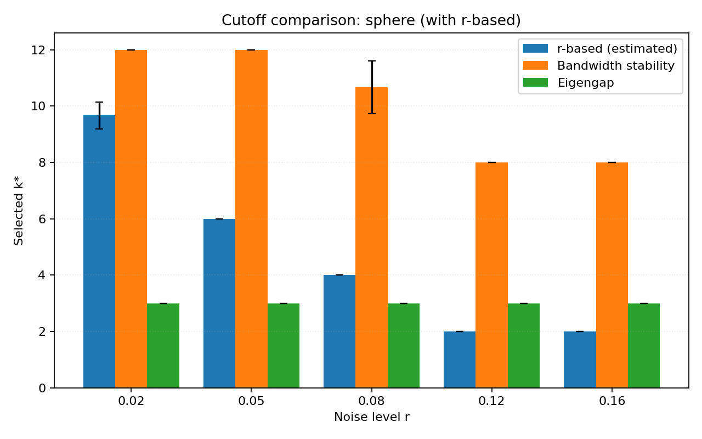
*Figure 7.4b: Cutoff comparison for the sphere. The r-based method is more aggressive than bandwidth stability, especially at higher noise.*

**Key findings on the r-based cutoff:**

1. **With estimated r on the circle**, the r-based cutoff shows the right qualitative behavior: k decreases from 12 to 5 as noise increases from 0.02 to 0.16. Ironically, the estimator's underestimation of r *helps* — because r̂ < r_true, the formula C/r̂² gives a larger k than C/r_true², partially compensating for the overly conservative C.

2. **With known r on the circle**, the cutoff is too aggressive: k = 12 at r = 0.02 but drops to k = 2 at r = 0.08 and k = 1 at r = 0.16. This happens because C = 0.015 is tiny — the formula says almost no modes survive at moderate noise. The issue is that C was calibrated from the oracle, which itself selects very few modes.

3. **On the sphere with estimated r**, the cutoff decreases from 9.7 to 2.0, which is reasonable but substantially lower than bandwidth stability's 12 → 8. At r = 0.12 and r = 0.16, k = 2 may be too aggressive.

4. **The fundamental tension**: the r-based formula requires knowing both r and C. We can estimate r (with significant bias), and we can calibrate C from oracle data (which itself is very conservative). The composition of these two imperfect estimates produces a cutoff that is sometimes reasonable and sometimes too extreme.

Bandwidth stability avoids all of these issues by not needing to estimate r or C. It directly observes which modes are stable, making it a more robust practical approach — exactly as the professor suggested.

---

## 8. Discussion

### 8.1 What Bandwidth Stability Gets Right

The method's main strength is **noise-adaptive cutoff selection**. On the circle, k decreases from 8 to 4 as noise increases from 0.02 to 0.16, with zero variance across seeds. The eigengap cannot do this — it always picks k = 2 regardless of noise. When noise is low, the eigengap leaves information on the table; when noise is high, stability is more conservative.

The method is also **more robust on gradual-decay spectra**. On the s-curve, the eigengap gives k = 1 (trivially low) while stability gives k = 13 with +3.5 pp trustworthiness. Both methods are seed-consistent on the s-curve, which shows that the instability of eigengap on the swiss roll is not just about sensitivity — it is about whether the spectrum has the structure the eigengap assumes.

### 8.2 The Swiss-Roll Failure: Per-Vector vs Subspace Alignment

The swiss roll failure is the most instructive result. The method measures stability by aligning individual eigenvectors: |⟨ψ_k^a, ψ_k^b⟩|. On the swiss roll, even a small bandwidth change can cause eigenvectors to rotate within their eigenspace without the underlying signal quality degrading. This looks like instability to our metric even though the *subspace* is stable.

A fix would be to use principal angles between subspaces: compare span{ψ₁…ψ_k}^a against span{ψ₁…ψ_k}^b. We have the principal-angle code but did not complete the integration. This is the highest-priority extension.

### 8.3 The Difficulty of Noise Estimation

The r-estimation experiments validate the professor's prediction. The kNN-based estimator conflates noise with manifold geometry:

- On the **circle** (D = 3, d = 1): nearest-neighbor distances are dominated by the manifold arc, underestimating r by 31–69%.
- On the **sphere** (D = 5, d = 2): at low noise, surface distances dominate, overestimating r by 2×. At high noise, noise contributes more and the estimate improves.
- On the **swiss roll** (D = 3, d = 2): manifold distances completely dominate; the estimator returns ~0.21 regardless of true r.

The core issue is that kNN distances contain both noise and manifold contributions, and separating them requires knowing the manifold — which is what we are trying to learn. This is the circular dependency the professor warned about.

### 8.4 The r-Based Formula: Theory vs Practice

The formula k* = C/r² is theoretically elegant but practically limited because:

1. **C is tiny** in our experiments (~0.015). This means the formula transitions from "keep maximum modes" to "keep 1 mode" over a narrow r range.
2. **r estimation is biased** — systematically too low on the circle, too high on the sphere at low noise, and useless on the swiss roll.
3. **The composition of biased C and biased r̂ can accidentally work** (the circle's underestimated r partially compensates for the conservative C) but is not reliable.

Bandwidth stability avoids all three issues. It does not need C or r; it directly probes which modes are signal vs noise through their bandwidth invariance. This confirms the professor's suggestion was well-founded.

### 8.5 Sensitivity to Hyperparameters

**Stability threshold τ**: On the circle at r = 0.08, τ has minimal impact (Table 6.7) because the stability transition is sharp. On the swiss roll, τ is decisive — lowering it to 0.80 might allow some modes through, but risks including noise.

**ε-grid**: The bandwidth sweep on the swiss roll shows that grid width matters. The usable range depends on the manifold's reach, which we do not know a priori. A practical approach: set the ε-grid as percentiles of the pairwise distance distribution.

**r-estimation k**: Using k = 1 or k = 2 for the NN distance estimator makes little difference in practice (we found stable results with k = 2).

---

## 9. Limitations and Future Work

1. **Per-vector alignment limitation**: The main algorithmic weakness. Subspace-based stability (principal angles) should fix the swiss roll failure and is implementable with existing code.

2. **Adaptive ε-grid**: Currently hand-tuned. Using percentiles of the pairwise distance distribution would make the method fully automatic.

3. **Non-monotonic stability profiles**: The s-curve's mode-10 dip suggests that a "stability gap" heuristic (analogous to eigengap but in stability space) could be better than a fixed threshold.

4. **Sample size**: All experiments use n ≤ 500. Larger n would sharpen eigenvalue separation and might improve both the stability method and the r estimator.

5. **Ambient dimension**: Our experiments use D ≤ 6. The curse of dimensionality could change the ε-grid's effective range at higher D.

6. **Noise estimation in high dimensions**: The kNN estimator degrades with ambient dimension. More sophisticated methods (e.g., random projection into low-dimensional subspaces before estimating r) could help.

7. **Real data**: We tested only on synthetic manifolds. Real data would introduce additional challenges: unknown d, unknown D, non-Gaussian noise, varying density.

8. **The constant C**: We calibrated C empirically from oracle data, but C should in principle be derivable from manifold properties. Connecting the empirical C to curvature and reach estimates is an open question.

---

## 10. Conclusion

We built and evaluated a bandwidth-stability truncation rule for diffusion maps, following the professor's suggestion to use eigenvector stability across kernel bandwidths as an alternative to direct noise estimation. The method works well on manifolds with uniform curvature (circle, sphere, s-curve): it produces noise-adaptive, seed-consistent cutoffs and matches or beats the eigengap baseline. On the swiss roll it fails because per-vector alignment cannot handle eigenvector reordering across bandwidths.

We also implemented the original proposal's r-based approach (Phase 2c). The kNN noise estimator is systematically biased — underestimating on low-dimensional manifolds and dominated by manifold geometry on the swiss roll — confirming the professor's prediction that "nearest neighbor distances are heavily biased by the curse of dimensionality and curvature, not just noise." The r-based cutoff k* = C/r² can produce qualitatively correct behavior when estimation errors partially cancel, but is less reliable than bandwidth stability as a general-purpose method.

The main contributions of this project are:

1. **Empirical validation** that bandwidth stability is a viable noise-adaptive truncation rule, with concrete results on five manifolds showing when it works and why it fails.
2. **Quantification of the difficulty** of estimating noise amplitude from kNN distances, with manifold-by-manifold analysis of estimator bias.
3. **Testing the theoretical formula** k* = C/r² in practice, showing that the empirically calibrated C is very conservative and the formula's utility is limited by the joint uncertainty in C and r.
4. **A complete, reproducible toolkit** (120 experiment runs, config-driven pipeline, automated analysis) that can be extended to subspace-based stability and real-data experiments.

The project narrative — from proposal to feedback to phased implementation — demonstrates how theoretical insight (the noisy-Laplacian threshold) can motivate practical tools (bandwidth stability) even when the direct theoretical formula (k* = C/r²) is hard to use in practice.

---

## Appendix

### A. Notation

| Symbol | Meaning |
|--------|---------|
| n | Number of data points |
| D | Ambient dimension |
| d | Intrinsic dimension of the manifold |
| r | Noise standard deviation (additive Gaussian) |
| r̂ | Estimated noise standard deviation |
| ε | Kernel bandwidth |
| α | Anisotropic normalisation parameter (0.5) |
| t | Diffusion time |
| k | Number of non-trivial eigenvectors retained |
| k* | Selected cutoff |
| τ | Stability threshold (default 0.9) |
| C(M) | Geometry-dependent constant (reach, curvature) |

### B. References

1. Coifman, R. R., & Lafon, S. (2006). *Diffusion maps*. Applied and Computational Harmonic Analysis, 21(1), 5–30.
2. von Luxburg, U. (2007). *A tutorial on spectral clustering*. Statistics and Computing, 17, 395–416.
3. Zelnik-Manor, L., & Perona, P. (2004). *Self-tuning spectral clustering*. NeurIPS 17.
4. Levina, E., & Bickel, P. J. (2004). *Maximum likelihood estimation of intrinsic dimension*. NeurIPS 17.
5. The noisy Laplacian threshold phenomenon — see `references/15271_The_Noisy_Laplacian_a_Th.pdf`.
6. El Karoui, N. & Wu, H.-T. — Connection graph Laplacian robustness to noise — see `references/Connection graph Laplacian methods can be made robust to noise Noureddine El Karoui and Hau-tieng Wu.pdf`.

### C. All Analysis Plots

The following plots are generated by the analysis scripts and stored in `results/analysis/`:

| Plot file | Description |
|-----------|-------------|
| `oracle_scaling.png` | k_oracle vs 1/r² for each manifold (Figure 7.2) |
| `method_comparison_circle.png` | Cutoff comparison: circle (Figure 6.1c) |
| `method_comparison_sphere.png` | Cutoff comparison: sphere (Figure 6.2) |
| `method_comparison_torus.png` | Cutoff comparison: torus (Figure 6.5) |
| `quality_metrics_circle.png` | Trustworthiness, continuity, geodesic consistency vs noise: circle |
| `quality_metrics_sphere.png` | Quality metrics vs noise: sphere |
| `oracle_subspace_profile_circle.png` | d_sub(k) vs k: circle (Figure 6.9a) |
| `oracle_subspace_profile_sphere.png` | d_sub(k) vs k: sphere (Figure 6.9b) |
| `threshold_sensitivity.png` | k* vs τ (Figure 6.7) |
| `r_estimation_simple.png` | r̂_simple vs r_true (Figure 7.3a) |
| `r_estimation_twoscale.png` | r̂_twoscale vs r_true (Figure 7.3b) |
| `r_based_comparison_circle.png` | 3-method comparison with r-based: circle (Figure 7.4a) |
| `r_based_comparison_sphere.png` | 3-method comparison with r-based: sphere (Figure 7.4b) |

Per-run figures (stability curves, spectra, embeddings, ablation charts) are in each run's `figures/` directory under `results/`.

### D. Metric Source Paths

All quantitative claims are drawn from these files (run IDs are timestamps under `results/`):

**Phase 1 runs:**
- `results/20260227_203217_smoke_small/metrics.json` (circle smoke test)
- `results/20260227_202434_swiss_roll_stability/metrics.json` (swiss roll baseline)
- `results/20260227_183932_synthetic_noise_sweep/records.json` (swiss roll noise sweep)
- `results/20260302_173937_synthetic_bandwidth_sweep/records.json` (bandwidth sweep)
- `results/20260302_173959_ambiguous_gap_suite/records.json` (s-curve head-to-head)
- `results/20260302_174201_eigengap_ambiguous_suite/records.json` (sphere ℝ⁶)
- `results/20260302_174322_noise_sweep_circle_sphere/records.json` (circle+sphere sweep, 18 runs)
- `results/20260303_161930_threshold_sensitivity_circle/aggregate.json` (threshold sensitivity)
- `results/20260303_161930_torus_noise_sweep/records.json` (torus sweep)

**Phase 2c runs:**
- `results/20260303_163008_r_estimation_circle_sphere/records.json` (r-estimation, 30 runs)
- `results/20260303_163008_r_validation_known_r/records.json` (known-r validation, 18 runs)
- `results/20260303_163008_r_estimation_swiss_roll/records.json` (swiss roll r-estimation, 6 runs)

Individual run metrics are in each sub-run directory's `metrics.json` and `cutoffs.json`.

### E. Experiment Reproduction

```bash
pip install -e .[dev]

# Phase 1 experiments
python3 -m nase run --config configs/smoke_small.yaml
python3 -m nase run --config configs/swiss_roll_stability.yaml
python3 -m nase sweep --config configs/synthetic_noise_sweep.yaml
python3 -m nase sweep --config configs/synthetic_bandwidth_sweep.yaml
python3 -m nase sweep --config configs/noise_sweep_circle_sphere.yaml
python3 -m nase sweep --config configs/ambiguous_gap_suite.yaml
python3 -m nase sweep --config configs/eigengap_ambiguous_suite.yaml
python3 -m nase sweep --config configs/threshold_sensitivity_circle.yaml
python3 -m nase sweep --config configs/torus_noise_sweep.yaml

# Phase 2c experiments
python3 -m nase sweep --config configs/r_estimation_circle_sphere.yaml
python3 -m nase sweep --config configs/r_validation_known_r.yaml
python3 -m nase sweep --config configs/r_estimation_swiss_roll.yaml

# Analysis scripts
python3 scripts/analyze_results.py
python3 scripts/analyze_r_estimation.py

# Tests
python3 -m pytest -q
```
