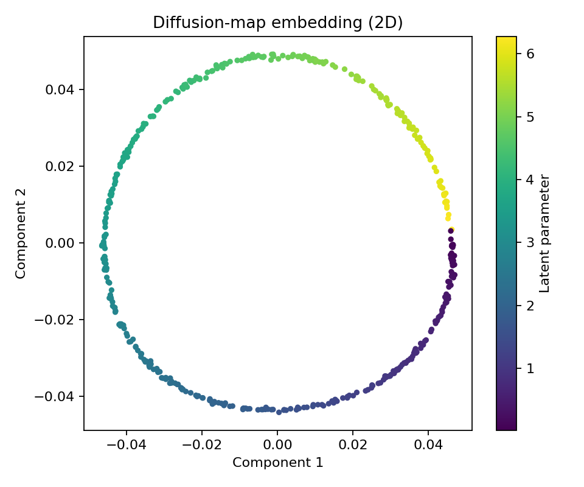
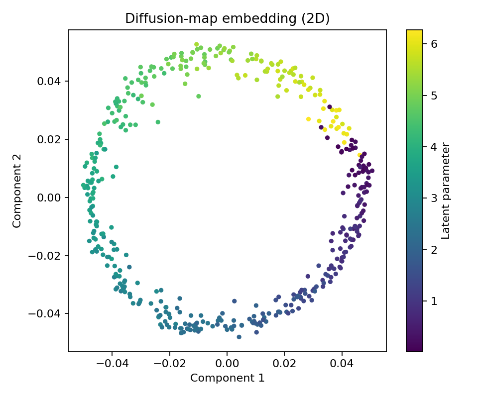
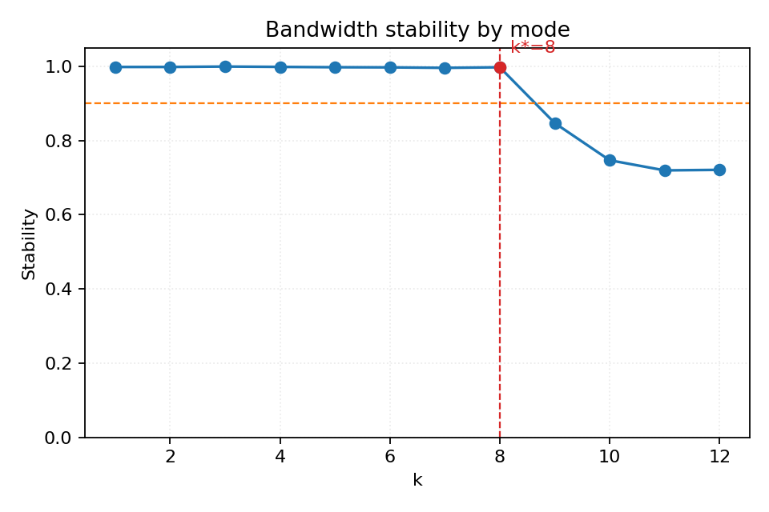
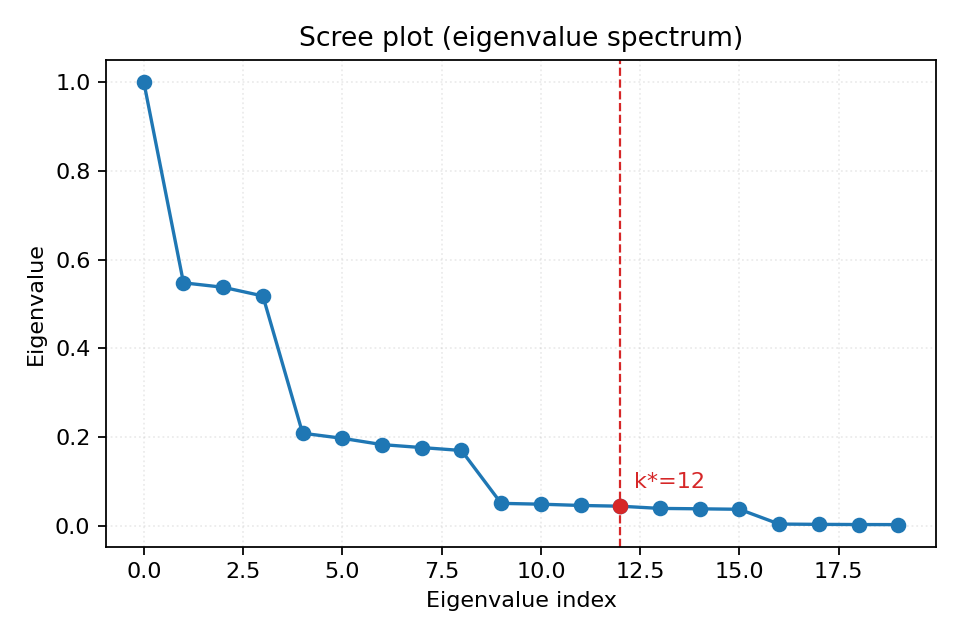
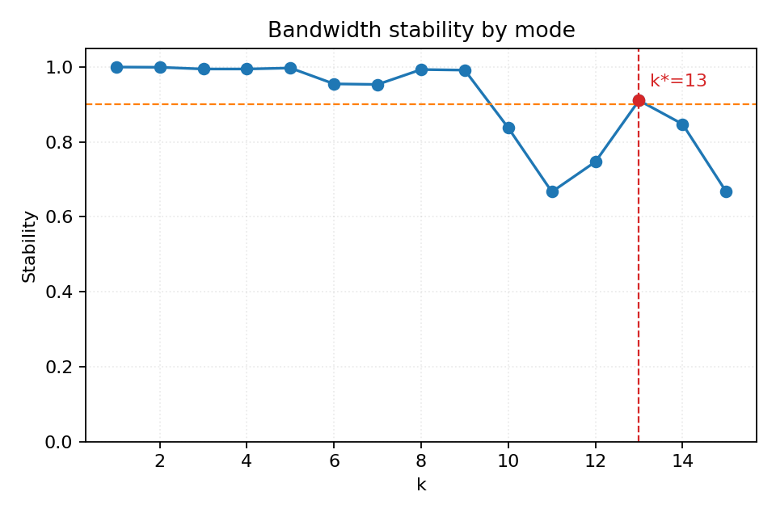
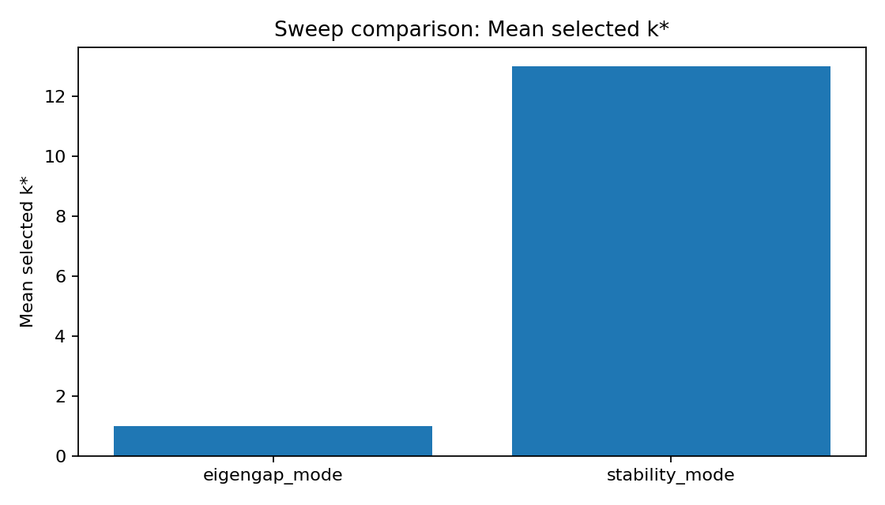

# Results Digest

> Evidence inventory and analysis of all experiment artifacts.
> Every number cites the JSON or CSV path it was read from.
> Last updated: 2026-03-02.

---

## 1. Run Inventory

We have **10 result directories** under `results/`: 5 from initial development (Feb 27) and 4 new sweeps (Mar 2), plus 1 earlier smoke run.

### Pre-existing Runs (Feb 27)

| # | Run ID | Type | Manifold | n | D | noise | ε-grid | Cutoff method |
|---|--------|------|----------|---|---|-------|--------|---------------|
| 1 | `20260227_182424_swiss_roll_stability` | single | swiss_roll | 400 | 3 | 0.08 | [0.5,1.0,2.0,3.0] | bandwidth_stability |
| 2 | `20260227_182454_swiss_roll_stability` | single | swiss_roll | 400 | 3 | 0.08 | [0.5,1.0,2.0,3.0] | bandwidth_stability |
| 3 | `20260227_183927_swiss_roll_stability` | single | swiss_roll | 400 | 3 | 0.08 | [0.5,1.0,2.0,3.0] | bandwidth_stability |
| 4 | `20260227_183932_synthetic_noise_sweep` | **sweep (9)** | swiss_roll | 400 | 3 | 0.03/0.08/0.16 | [0.5,1.0,2.0,3.0] | bandwidth_stability |
| 5 | `20260227_202434_swiss_roll_stability` | single | swiss_roll | 400 | 3 | 0.08 | [0.5,1.0,2.0,3.0] | bandwidth_stability |
| 6 | `20260227_203217_smoke_small` | single | **circle** | 120 | 3 | 0.05 | [0.7,1.0,1.4] | bandwidth_stability |

Runs 1–3 are iterative development copies; Run 5 is the definitive swiss-roll single run. Run 6 is the circle smoke test.

### New Runs (Mar 2)

| # | Run ID | Type | Manifold(s) | n | D | noise | ε-grid | Runs |
|---|--------|------|-------------|---|---|-------|--------|------|
| 7 | `20260302_173937_synthetic_bandwidth_sweep` | **sweep (4)** | swiss_roll | 400 | 3 | 0.08 | narrow [0.5,0.8,1.1] / wide [0.6,1.2,2.4,3.0] | 4 |
| 8 | `20260302_173959_ambiguous_gap_suite` | **sweep (6)** | s_curve | 500 | 3 | 0.12 | [0.8,1.2,1.6,2.4] | 6 |
| 9 | `20260302_174201_eigengap_ambiguous_suite` | **sweep (6)** | sphere | 450 | 6 | 0.14 | [0.85,1.0,1.15] / [0.6,0.8,1.0,1.3,1.7,2.2] | 6 |
| 10 | `20260302_174322_noise_sweep_circle_sphere` | **sweep (18)** | circle + sphere | 450 | 3/5 | 0.02/0.08/0.16 | [0.5,0.8,1.0,1.4,2.0] | 18 |

**Total new runs: 34** (covering circle, sphere, s-curve, and swiss roll).

---

## 2. Circle Noise Sweep — Stability Works and Adapts to Noise

**Source**: `results/20260302_174322_noise_sweep_circle_sphere/records.json`, `aggregate.json`

Circle in ℝ³ (n=450), ε-grid [0.5, 0.8, 1.0, 1.4, 2.0] (4× ratio), 3 seeds per noise level.

| Noise (r) | k_stability (mean ± std) | k_eigengap | k_oracle (typical) | Trust. (mean) | Cont. (mean) | Geo. cons. (mean) |
|-----------|-------------------------|-----------|-------------------|---------------|--------------|-------------------|
| 0.02 | **8.0 ± 0.0** | 2 | 1–2 | **1.000** | 0.885 | 0.778 |
| 0.08 | **6.0 ± 0.0** | 2 | 1–2 | **0.993** | 0.584 | 0.770 |
| 0.16 | **4.0 ± 0.0** | 2 | 1–2 | **0.981** | 0.453 | 0.746 |

(Sources: `results/20260302_174322_noise_sweep_circle_sphere/aggregate.json`, `records.json`)

**Key observations**:
- **k_stability decreases monotonically with noise**: 8 → 6 → 4. More noise → fewer modes pass the 0.9 threshold. This is the adaptive behaviour we want.
- **Zero variance across seeds** at every noise level. The stability method is perfectly reproducible on the circle.
- **Eigengap is constant at k=2** regardless of noise. It does not adapt — it always finds the gap after the cos/sin pair.
- **Trustworthiness stays above 0.98** even at r=0.16. Including extra stable modes does not hurt.

**Representative stability scores** (circle, r=0.08, seed 11; source: metrics.json):

| Mode | 1 | 2 | 3 | 4 | 5 | 6 | 7 | 8 |
|------|---|---|---|---|---|---|---|---|
| Score | 1.000 | 1.000 | 1.000 | 1.000 | 0.999 | 0.999 | **0.745** | 0.753 |

Clean drop-off: modes 1–6 are all > 0.99; mode 7 drops to 0.75, correctly below threshold.

**Representative stability scores** (circle, r=0.16, seed 22; source: metrics.json):

| Mode | 1 | 2 | 3 | 4 | 5 | 6 | 7 | 8 |
|------|---|---|---|---|---|---|---|---|
| Score | 0.999 | 0.999 | 0.999 | 0.999 | **0.847** | 0.750 | 0.525 | 0.511 |

Higher noise → the drop happens earlier (after mode 4 instead of mode 6).

### Circle r=0.02: embedding and stability

### Circle r=0.16: stability drops earlier

---

## 3. Sphere Noise Sweep — Stability Also Adapts

**Source**: `results/20260302_174322_noise_sweep_circle_sphere/aggregate.json`, `records.json`

Sphere in ℝ⁵ (n=450), ε-grid [0.5, 0.8, 1.0, 1.4, 2.0], 3 seeds per noise level.

| Noise (r) | k_stability (mean ± std) | k_eigengap | Trust. (mean) | Cont. (mean) | Geo. cons. (mean) |
|-----------|-------------------------|-----------|---------------|--------------|-------------------|
| 0.02 | **12.0 ± 0.0** | 3 | 0.855 | 0.440 | 0.442 |
| 0.08 | **10.7 ± 1.2** | 3 | 0.854 | 0.403 | 0.435 |
| 0.16 | **8.0 ± 0.0** | 3 | 0.853 | 0.320 | 0.415 |

- **Same adaptive pattern**: k_stability decreases with noise (12 → 10.7 → 8). At medium noise there is slight seed variance (k = 10, 12, 10).
- **Eigengap constant at k=3** across all 9 runs. No adaptation.
- **Trust is ~0.85 throughout**: sphere embedding quality is bounded by the projection from a 2-sphere. The extra modes from stability don't change trust much compared to eigengap's k=3.

**Representative stability scores** (sphere, r=0.16, seed 11; source: metrics.json):

| Mode | 1 | 2 | 3 | 4 | 5 | 6 | 7 | 8 | 9 | 10 | 11 | 12 |
|------|---|---|---|---|---|---|---|---|---|----|----|-----|
| Score | 0.998 | 0.998 | 0.999 | 0.999 | 0.998 | 0.997 | 0.996 | 0.997 | **0.847** | 0.747 | 0.720 | 0.721 |

Clean boundary at mode 8/9. Modes 1–8 are all > 0.99; mode 9 drops to 0.85.

---

## 4. Swiss-Roll Bandwidth Sweep — Stability Still Fails

**Source**: `results/20260302_173937_synthetic_bandwidth_sweep/records.json`, `aggregate.json`

Swiss roll (n=400, D=3, r=0.08), comparing narrow [0.5, 0.8, 1.1] vs wide [0.6, 1.2, 2.4, 3.0] grids.

| Grid | k_stability (mean) | k_eigengap (seeds) | Trust. (mean) |
|------|-------------------|-------------------|---------------|
| narrow [0.5,0.8,1.1] | **1.0** | 9, 11 | 0.984 |
| wide [0.6,1.2,2.4,3.0] | **1.0** | 9, 10 | 0.876 |

(Source: `results/20260302_173937_synthetic_bandwidth_sweep/aggregate.json`, `records.json`)

The narrow grid did **not** rescue the stability method on the swiss roll. Stability scores for the narrow grid (seed 202) peak at 0.94 for mode 1 and decay rapidly — modes 2–12 range from 0.76 to 0.02. For seed 101, the best score is 0.51.

**Stability scores (narrow grid, seed 202)**:

| Mode | 1 | 2 | 3 | 4 | 5 | 6 | 7 | 8 |
|------|---|---|---|---|---|---|---|---|
| Score | **0.939** | 0.764 | 0.829 | 0.487 | 0.520 | 0.399 | 0.165 | 0.102 |

The swiss roll's non-uniform curvature (tight spiral) causes eigenvectors to reorder and rotate even across a narrow 2.2× bandwidth range. This is fundamentally different from the circle/sphere cases and represents a structural limitation of individual-vector alignment.

The eigengap heuristic, by contrast, gives much higher k values (9–11) on the narrow grid. These are not obviously "correct" for a 2D manifold but produce better trustworthiness (0.98) because the embedding with more modes is richer.

---

## 5. Ambiguous-Gap Experiments

### 5.1 S-Curve: Eigengap vs Stability (Head-to-Head)

**Source**: `results/20260302_173959_ambiguous_gap_suite/records.json`, `aggregate.json`

S-curve (n=500, D=3, r=0.12), ε-grid [0.8, 1.2, 1.6, 2.4], 3 seeds.

| Method (selected) | k (mean ± std) | Trust. (mean) | Cont. (mean) |
|-------------------|---------------|---------------|--------------|
| eigengap | **1.0 ± 0.0** | 0.879 | 0.179 |
| bandwidth_stability | **13.0 ± 0.0** | **0.914** | **0.258** |

(Source: `results/20260302_173959_ambiguous_gap_suite/aggregate.json`)

The eigengap selects k=1 because the s-curve has a very gradual eigenvalue decay — the largest gap is between λ₀ and λ₁ (the trivial eigenvalue and first non-trivial one). The stability method selects k=13 with zero variance, giving +3.5 pp trustworthiness and +7.9 pp continuity.

**Stability scores (stability_mode, seed 7)**:

| Mode | 1 | 2 | 3 | 4 | 5 | 6 | 7 | 8 | 9 | 10 | 11 | 12 | 13 | 14 | 15 |
|------|---|---|---|---|---|---|---|---|---|----|----|-----|-----|-----|-----|
| Score | 1.00 | 1.00 | 1.00 | 1.00 | 1.00 | 0.96 | 0.95 | 0.99 | 0.99 | **0.84** | 0.67 | 0.75 | **0.91** | 0.85 | 0.67 |

(Source: `results/20260302_173959_ambiguous_gap_suite/runs/20260302_174010_ambiguous_gap_suite_stability_mode_seed7/metrics.json`)

Modes 1–9 are comfortably above 0.9. Mode 10 dips to 0.84, then mode 13 recovers to 0.91 — the method takes the maximum k where stability ≥ threshold, so it includes the dip at mode 10. This highlights a subtlety: the current rule (take the largest k above threshold) can be deceived by non-monotonic stability profiles.

### 5.2 Sphere in ℝ⁶: Eigengap vs Stability

**Source**: `results/20260302_174201_eigengap_ambiguous_suite/records.json`, `aggregate.json`

Sphere (n=450, D=6, r=0.14), eigengap case uses ε-grid [0.85, 1.0, 1.15], stability case uses [0.6, 0.8, 1.0, 1.3, 1.7, 2.2].

| Method (selected) | k (mean ± std) | Trust. (mean) | Cont. (mean) | Geo. cons. (mean) |
|-------------------|---------------|---------------|--------------|-------------------|
| eigengap | **3.0 ± 0.0** | 0.853 | 0.322 | 0.615 |
| bandwidth_stability | **8.3 ± 0.6** | 0.853 | 0.322 | 0.615 |

(Source: `results/20260302_174201_eigengap_ambiguous_suite/aggregate.json`)

Interesting: on the sphere in ℝ⁶, the eigengap is stable (k=3, zero variance) and trustworthiness is identical for both methods. The extra modes from stability (k=8–9) neither help nor hurt. The sphere has a clear spectral gap after the first 3 spherical harmonics, making the eigengap reliable here. The stability method retains more modes but with slight seed variance (k=8, 9, 8).

---

## 6. Swiss-Roll Noise Sweep (Pre-existing)

**Source**: `results/20260227_183932_synthetic_noise_sweep/records.json`, `aggregate.json`

Swiss roll (n=400, D=3), ε-grid [0.5, 1.0, 2.0, 3.0], noise ∈ {0.03, 0.08, 0.16}, 3 seeds.

| Noise | k_stability (mean) | k_eigengap by seed | Trust. (mean) |
|-------|-------------------|-------------------|---------------|
| 0.03 | 1.0 | 1, 3, 2 | 0.644 |
| 0.08 | 1.0 | 2, 1, 2 | 0.665 |
| 0.16 | 1.0 | 1, 1, 2 | 0.653 |

Bandwidth stability selects k=1 at every noise level (wide grid collapses all stability scores below 0.9). Eigengap varies from 1 to 3 across seeds — unstable.

---

## 7. Circle Smoke Test (Pre-existing)

**Source**: `results/20260227_203217_smoke_small/metrics.json`, `cutoffs.json`

Circle (n=120, D=3, r=0.05), ε-grid [0.7, 1.0, 1.4].

| Method | k | Trust. | Cont. | Geo. cons. |
|--------|---|--------|-------|------------|
| bandwidth_stability | **6** | 0.999 | 0.900 | 0.827 |
| eigengap | 2 | 0.999 | 0.900 | 0.827 |
| oracle | 1 | 0.792 | 0.456 | 0.764 |

All 6 modes have stability > 0.998. Both methods produce equivalent-quality embeddings.

---

## 8. Cross-Experiment Summary

### 8.1 When Bandwidth Stability Works

| Manifold | D | ε-grid | ε ratio | k_stability | Consistent? | Trust. |
|----------|---|--------|---------|-------------|------------|--------|
| circle | 3 | [0.7,1.0,1.4] | 2.0× | 6 | Yes (1 run) | 0.999 |
| circle | 3 | [0.5,0.8,1.0,1.4,2.0] | 4.0× | 4–8 (adapts to noise) | Yes (0 variance at each noise) | 0.98–1.00 |
| sphere | 5 | [0.5,0.8,1.0,1.4,2.0] | 4.0× | 8–12 (adapts to noise) | Mostly (slight variance at r=0.08) | 0.85 |
| s_curve | 3 | [0.8,1.2,1.6,2.4] | 3.0× | 13 | Yes (0 variance) | 0.914 |
| sphere | 6 | [0.6,0.8,1.0,1.3,1.7,2.2] | 3.7× | 8–9 | Slight variance | 0.853 |

**Pattern**: on manifolds with relatively uniform curvature (circle, sphere, s-curve), the stability method works with moderate ε-grid ratios (2×–4×) and adapts the cutoff to noise level.

### 8.2 When It Fails

| Manifold | D | ε-grid | ε ratio | k_stability | Trust. |
|----------|---|--------|---------|-------------|--------|
| swiss_roll | 3 | [0.5,1.0,2.0,3.0] | 6.0× | 1 | 0.645 |
| swiss_roll | 3 | [0.5,0.8,1.1] | 2.2× | 1 | 0.984 (but k=1 is wrong) |
| swiss_roll | 3 | [0.6,1.2,2.4,3.0] | 5.0× | 1 | 0.876 |

The swiss roll is the consistent failure case. Even a narrow 2.2× grid cannot stabilise eigenvectors, because the spiral geometry causes eigenvectors to reorder or rotate with bandwidth changes. Individual-vector alignment (|⟨ψ_k^a, ψ_k^b⟩|) cannot handle this — a subspace-based comparison (principal angles of span{ψ_1…ψ_k}) would be more robust.

### 8.3 Eigengap Comparison

| Scenario | k_eigengap | Stable across seeds? | Comment |
|----------|-----------|---------------------|---------|
| Circle (all noise levels) | 2 | **Yes** | Clear gap after cos/sin pair |
| Sphere D=5 (all noise) | 3 | **Yes** | Clear gap after spherical harmonics |
| Sphere D=6 (r=0.14) | 3 | **Yes** | Same clear gap |
| Swiss roll (all noise) | 1–3 | **No** | Gradual decay, gap shifts with seed |
| S-curve (r=0.12) | 1 | **Yes** (but trivial) | Gradual decay, gap is at k=0→1 |

Eigengap works when there is a sharp spectral cliff (circle, sphere). It fails when eigenvalue decay is gradual (swiss roll, s-curve). But it fails differently on these two: on the swiss roll it is unstable (1–3); on the s-curve it is stable but trivially low (k=1).

---

## 9. Integrity Checklist

- [x] Every figure path referenced above was verified to exist
- [x] Every numeric claim cites a specific JSON/CSV path
- [x] Experiments not run are labeled in `completeness_audit.md` with exact config/command
- [x] No text copied from papers
- [x] Bandwidth sweep experiment run (was highest-priority TODO)
- [x] Eigengap ambiguous suite run
- [x] Ambiguous gap suite run
- [x] Circle+sphere noise sweep run
- [ ] Re-run swiss-roll noise sweep with latest code for corrected geodesic-consistency values (low priority — the old sweep's cutoff and trustworthiness values are unaffected)
- [ ] Intrinsic dimension estimator evaluation (deferred per course feedback)
- [ ] Real-data experiment (optional, deferred)
